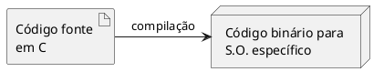
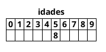
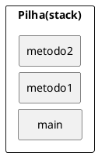

# Linguagens e paradigmas de programação


As informações desse capítulo foram retiradas basicamente de [^Pires] e [^Tedesco].


## Introdução

No passado escrevia-se programas utilizando apenas linguagens de baixo nível. A escrita é engessada, complexa e muito específica, sendo pouco acessível para os desenvolvedores no geral. Esse tipo de linguagem exige muito conhecimento de quem a programa (inclusive relacionado à forma com que o processador opera uma instrução-máquina).

Recentemente foi liberado o [código-conte](https://github.com/chrislgarry/Apollo-11) utilizado no computador que guiou a missão Apollo que teve como principal objetivo levar o homem à lua (na tão famigerada corrida espacial entre a União Soviética e os EUA), o *Apollo Guidance Computer.*

Um programa escrito em uma dessas linguagens, chamadas de baixo nível, é composto por uma série de instruções de máquina que determinam quais operações o processador deve executar. Essas instruções são convertidas para a linguagem que o processador entende, que é a linguagem binária (sequência de bits 0 e 1), que é categorizada como *First-generation programming language* (1GL), em livre tradução: linguagem de programação de primeira geração. 


## Linguagens de alto nível

Com a popularidade dos computadores criou-se um "problema" de alta demanda por software e, consequentemente, por programadores. Talvez você esteja pensando que isso não é exatamente um problema, e sim uma coisa boa, uma tendência, um novo mercado. Faz sentido, até certo ponto. O problema era encontrar mão de obra qualificada para codificar àquelas instruções tão complicadas.

Com isso, novas linguagens surgiram e, cada vez mais, aproximavam-se da linguagem humana. Isso abriu "fronteiras" para que uma enorme gama de novos desenvolvedores se especializassem. Tais linguagens são denominadas como sendo de alto nível. As linguagens modernas que hoje conhecemos e usamos são de alto nível: C, PHP, Java, Rust, C\#, Python, Ruby etc.

::: tip Dica
Quanto mais próxima da linguagem da máquina, mais baixo nível é a linguagem. Quanto mais próxima da linguagem humana, mais alto nível ela é.
:::

## Paradigmas das linguagens de programação

Quando uma linguagem de programação é criada, a partir das suas características, ela é categorizada em um ou mais paradigmas.

A definição do dicionário Aurélio para "paradigma":

- Algo que serve de exemplo geral ou de modelo.
- Conjunto das formas que servem de modelo de derivação ou de flexão.
- Conjunto dos termos ou elementos que podem ocorrer na mesma posição ou contexto de uma estrutura.

O paradigma de uma linguagem de programação é a sua identidade. Corresponde a um conjunto de características que, juntas, definem como ela opera e resolve os problemas. Algumas linguagens, inclusive, possuem mais de um paradigma, são as chamadas multi paradigmas.


Alguns dos principais paradigmas utilizados hoje no mercado:

- Funcional
- Lógico
- Declarativo
- Imperativo
- Orientado a objetos
- Orientado a eventos


### Paradigma funcional
O foco desse paradigma está na avaliação de funções. Como na matemática quando temos, por exemplo, uma função $f(x)$:

$$f(x) = x + 2$$

$x$ é um parâmetro (o valor de entrada) e, após a expressão ser avaliada, obtêm-se o resultado.

Se o valor de entrada for 2, o resultado da avaliação da nossa função será 4.

Algumas das linguagens que atendem a esse paradigma: F\# (da Microsoft), Lisp, Heskell, Erlang, Elixir, Mathematica.

É possível desenvolver de forma "funcional" mesmo em linguagens não estritamente funcionais. Por exemplo, no PHP, que é uma linguagem multi paradigma, teríamos:

```php
<?php

$sum = function($value) {
    return $value + 2;
};

echo $sum(2); // 4

```


### Paradigma lógico
Também é conhecido como "restritivo". Muito utilizado em aplicações de inteligência artificial. Esse paradigma chega no resultado esperado a partir de avaliações lógico-matemáticas. Se você já estudou lógica de predicados ficará confortável em entender como uma linguagem nesse paradigma opera.

Principais elementos desse paradigma:

- **Proposições:** base de fatos concretos e conhecidos.
- **Regras de inferência:** definem como deduzir proposições.
- **Busca:** estratégias para controle das inferências.


Exemplo:

**Proposição** 
: Chico é um gato.

**Regra de inferência**
: Todo gato é um felino.

**Busca**
: Chico é um felino?

A resposta para a **Busca** acima precisa ser **verdadeira**. A conclusão lógica é:


::: tip
Se Chico é um gato e todo gato é felino, então Chico é um felino.
:::

A ideia básica da programação em lógica é:

::: tip Prof. Dr. Sílvio do Lago Pereira – DTI / FATEC-SP.
Oferecer um arcabouço que permita inferir conclusões desejadas, a partir de premissas, representando o conhecimento disponível, de uma forma que seja computacionalmente viável.
:::

A linguagem mais conhecida que utiliza esse paradigma é a **Prolog.** Esse paradigma é pouco utilizado em aplicações comerciais, seu uso se dá mais na área acadêmica.


### Paradigma declarativo
O paradigma declarativo é baseado no lógico e funcional. Linguagens declarativas descrevem o que fazem e não exatamente como suas instruções funcionam.

Linguagens de marcação são o melhor exemplo: HTML, XML, XSLT, XAML etc. Não obstante, o próprio Prolog – reconhecido primariamente pelo paradigma lógico – também é uma linguagem declarativa. Abaixo alguns exemplos dessas linguagens.

HTML:
```html
<article>
  <header>
    <h1>Linguagens e paradigmas de programação</h1>
  </header>
</article>
```

SQL:
```sql
SELECT nome FROM usuario WHERE id = 10
```

### Paradigma imperativo

Você já ouviu falar em "programação procedural" ou em "programação modular"? De modo geral, são imperativas.

Linguagens clássicas como C, C++, PHP, Perl, C\#, Ruby etc, "suportam" esse paradigma. Ele é focado na mudança de estados de variáveis (ao contrário dos anteriores).

Exemplo:
```c
if(option == 'A') {
    print("Opção 'A' selecionada.");
}
```

A impressão só será realizada se o valor da variável $option$ for igual a $A$.


### Paradigma orientado a objetos

Esse é, entre todos, talvez o mais difundido. Nesse paradigma, ao invés de construirmos nossos sistemas com um conjunto estrito de procedimentos, assim como se faz em linguagens "fortemente" imperativas como o Cobol, Pascal etc, na orientação a objetos utilizamos uma lógica bem próxima do mundo real, lidando com objetos, estruturas que já conhecemos e sobre as quais possuímos uma grande compreensão.

::: tip Dica
OO é sigla para orientação a objetos
:::

O paradigma orientado a objetos tem uma grande preocupação em esconder o que não é importante e em realçar o que é importante. Nele, implementa-se um conjunto de classes que definem objetos. Cada classe determina o comportamento (definido nos métodos) e estados possíveis (atributos) de seus objetos, assim como o relacionamento entre eles.

Esse é o paradigma mais utilizado em aplicações comerciais e as principais linguagens o implementam: C\#, Java, PHP, Ruby, C++, Python etc.


### Paradigma orientado a eventos

Toda linguagem que faz uso de interface gráfica é baseada nesse paradigma. Nele, o fluxo de execução do software é baseado na ocorrência de eventos externos, normalmente disparados pelo usuário.

O usuário, ao interagir, decidirá em qual momento digitar, clicar no botão de "salvar" etc. Essas decisões dispararão eventos. O usuário é, então, o responsável por quando os eventos acontecerão, de tal forma que fluxo do programa fica sensivelmente atrelado à ocorrências desses eventos.

Linguagens de programação que fazem uso desse paradigma:
- Delphi
- Visual Basic
- C\#
- Python
- Java etc.


# Java

Nesse capítulo teremos um compilado de informações que foram reunidas de vários lugares ([^Deitel], [^Dornelles], [^Oracle], [^Santos]). Bons Estudos.

## Por que Java?

Existem diversas linguagens de programação orientadas a objeto, cada uma com diferentes características e apelos de mercado, educacionais ou acadêmicos. Segue, algumas das razões da escolha da linguagem Java.

**Java é obrigatoriamente orientada a objetos**
:   Algumas linguagens permitem que objetos e variáveis existam em diversos pontos de um programa, como se estivessem desatreladas de qualquer estrutura. Em Java, todas as variáveis e métodos devem estar localizados dentro de classes, forçando o uso de orientação a objetos até mesmo em tarefas simples. Dessa forma, o estudante de programação orientada a objetos que esteja usando Java estará usando mais as técnicas de POO.

**Java é simples**
:   A estrutura de programas e classes em Java segue a organização de linguagens tradicionais como C e C++, mas sem elementos que tornam programas e programação mais complexos. Após o aprendizado dos conceitos básicos de programação orientada a objetos, o estudante da linguagem pode começar a criar aplicativos úteis e complexos. A simplicidade se reflete também na maneira com que arquivos contendo programas em Java são compilados e executados: se as recomendações básicas forem seguidas, o compilador se encarregará de compilar todas as classes necessárias em uma aplicação automaticamente, sem necessidade de arquivos adicionais de configuração e inclusão de bibliotecas.

**Java é portátil**
:   O código-fonte de um programa ou classe em Java pode ser compilado em qualquer computador, usando qualquer sistema operacional, contanto que este tenha uma máquina virtual Java adequada. Adicionalmente, as classes criadas podem ser copiadas e executadas em qualquer computador nas mesmas condições, aumentando a utilidade da linguagem através da independência de plataformas, contanto que versões compatíveis da máquina virtual sejam usadas. 

**Java é gratuita**
:   A máquina virtual Java, mencionada acima, está à disposição para cópia no site da Oracle e em vários outros. Compiladores simples, de linha de comando (sem interfaces visuais elaboradas) fazem parte do JDK, o ambiente de desenvolvimento gratuito de Java. Aplicações em Java precisam de uma máquina virtual para sua execução, mas não existem limitações na distribuição da máquina virtual, fazendo de Java uma plataforma extremamente econômica para desenvolvedores e usuários finais.

**Java é robusta**
:   Administração de memória (alocação e liberação) e o uso de ponteiros, duas das fontes de erros e bugs mais frequentes em programas em C e C++, são administrados internamente na linguagem, de forma transparente para o programador. De maneira geral, programas em Java tem restrições no acesso à memória que resultam em maior segurança para os programas sem diminuir a utilidade dos mesmos. Java também tem um poderoso mecanismo de exceções que permite melhor tratamento de erros em tempo de execução dos programas.

**Java tem bibliotecas prontas para diversas aplicações**
:   As bibliotecas de classes de Java contém várias classes que implementam diversos mecanismos de entrada e saída, acesso à Internet, manipulação de Strings em alto nível, poderosas estruturas de dados, utilitários diversos e um conjunto completo de classes para implementação de interfaces gráficas. Vale a pena relembrar que estas bibliotecas são padrão de Java - qualquer máquina virtual Java permite o uso destas bibliotecas, sem a necessidade de instalar pacotes adicionais, e que mesmo que o compilador usado não tenha interface gráfica similar à de linguagens visuais, os programas criados com este compilador podem ter interfaces gráficas complexas.


## História

A história da tecnologia Java começou modestamente no final de 1990, quando a empresa Sun Microsystems encarregou seus funcionários Patrick Naughton, Mike Sheridan e James Gosling da tarefa de descobrir qual seria a próxima grande tendência na área da computação. O projeto, denominado "Green Project", chegou à seguinte conclusão preliminar: a integração dos dispositivos controlados digitalmente com os computadores iria se tornar uma tendência muito importante.

Aquele revolucionário dispositivo remoto, conectado à rede sem fio, rodava uma versão do sistema operacional Unix e possuía uma tela sensível ao toque (touchscreen) – lembre-se que estávamos em 1992 e, para se ter uma ideia do desenvolvimento da Internet naquela época, basta dizer que, no final do ano, havia apenas 26 servidores Web no mundo! A interface de usuário incluía também um assistente de ajuda: um simpático personagem de desenho animado chamado **Duke,** que mais tarde seria adotado como mascote da plataforma Java.

O Star 7 incorporava "uma nova linguagem de programação dinâmica, compacta, segura, distribuída, robusta, interpretada, incorporando garbage collection e multi-threading, neutra à arquitetura de hardware e de alto desempenho" a fim de solucionar os vários problemas pertinentes ao desenvolvimento de programas para execução na plataforma Star 7. James Gosling criou a linguagem e deu-lhe o nome de "Oak", em homenagem a um enorme carvalho que podia ser visto da janela do seu escritório.

O "Green Project" teve o seu grande momento de glória e surgiu a oportunidade de produzir dispositivos similares ao Star 7 para consumidores em potencial na indústria de TV a cabo. "Equipe Green" mudou de nome para "FirstPerson" e preparou um filme para demonstração da sua tecnologia aos produtores de transcodificadores de TV e aluguel de vídeo. Mas, infelizmente para a equipe, aqueles setores, ainda na sua infância, estavam em processo de criação de modelos de negócio viáveis. A despeito do insucesso da "FirstPerson" com a TV a cabo, o tipo de configuração da sua tecnologia de rede era idêntica à configuração de rede para a Internet, que passava por um avassalador processo de popularização.

A Internet usava a *HyperText Markup Language* (HTML) para transportar o conteúdo de mídia – texto, vídeo, imagens, áudio, etc. – através de uma rede de dispositivos heterogêneos. De uma forma similar, Java (um nome substituto para Oak, a fim de contornar problemas de natureza legal com outra linguagem de nome idêntico) também movimentava o conteúdo de mídia através de uma rede de dispositivos heterogêneos, mas ia além: transportava também o seu "comportamento", na forma de applets. A linguagem HTML não conseguia fazer isso.

Para demonstrar a utilidade de Java numa Web baseada na Internet, a "FirstPerson" fez um clone do navegador Mosaic e, em 1994, o navegador WebRunner (mais tarde conhecido como HotJava), "deu vida, pela primeira vez, a objetos animados e a conteúdo executável dinamicamente dentro de um navegador."

John Gage, diretor do Escritório de Ciências da Sun, e James Gosling, fizeram uma demonstração do WebRunner numa reunião com profissionais da Internet e da área de entretenimento no início de 1995. A plateia aplaudiu calorosamente as demonstrações de uma molécula tridimensional giratória e a animação de um algorítimo de ordenação preparado por Gosling, embutidas em páginas Web apresentadas no WebRunner. O futuro certamente havia chegado. A notícia se espalhou rapidamente, e a "FirstPerson" disponibilizou o WebRunner para download.

Milhares de downloads chamaram a atenção da Sun para a popularidade de Java, e ela disponibilizou uma área no seu site para divulgar essa tecnologia. Em maio de 1995, durante a abertura da feira SunWorld da Sun, o líder do projeto Netscape, Marc Andreessen, anunciou que iriam integrar Java ao novo navegador para a Web Netscape.

O Java é agora utilizado para desenvolver aplicativos corporativos de grande porte, aprimorar a funcionalidade de servidores da web (os computadores que fornecem o conteúdo que vemos em nossos navegadores), fornecer aplicativos para dispositivos voltados ao consumo popular (por exemplo, telefones celulares, smartphones, televisão, set-up boxes etc.) e para muitos outros propósitos. Ainda, ele também é a linguagem-chave para desenvolvimento de aplicativos Android adequados a smartphones e tablets. 

Devida a essa grande aplicabilidade em abril de 2009, a Oracle ofereceu US\$ 7,4 bilhões pela aquisição da Sun Microsystems e a proposta foi aceita. Essa aquisição deu à Oracle a propriedade de vários produtos, incluindo o Java e o sistema operacional Solaris. Em comunicado, a Oracle afirmou que o Java foi o software mais importante adquirido ao longo de sua história. Muitas especulações foram feitas a cerca do futuro do Java depois de passar a ser propriedade da Oracle. Mais com certeza essa aquisição contribuiu muito para que o Java tivesse um salto qualitativo.


## Máquina Virtual

Em uma linguagem de programação como C e Pascal, temos a seguinte situação quando vamos compilar um programa:

<figure>



<figcaption> Representação do processo de compilação.</figcaption>
</figure>

O código fonte é compilado para código de máquina específico de uma plataforma e sistema operacional.

Muitas vezes o próprio código fonte é desenvolvido visando uma única plataforma!

Esse código executável (binário) resultante será executado pelo sistema operacional e, por esse motivo, ele deve saber conversar com o sistema operacional em questão.

<figure>

```plantuml
@startuml

!define SPRITESURL https://raw.githubusercontent.com/plantuml-stdlib/gilbarbara-plantuml-sprites/v1.0/sprites
!includeurl SPRITESURL/microsoft-windows.puml
!includeurl SPRITESURL/ubuntu.puml
!includeurl SPRITESURL/apple.puml


skinparam monochrome false

artifact f1 as "Código fonte \nem C'"
artifact f2 as "Código fonte \nem C''"
artifact f3 as "Código fonte \nem C'''"

node "exe" as b1
node "bin" as b2
node "app" as b3

rectangle "<$microsoft-windows>" as exe
rectangle "<$ubuntu>" as bin
rectangle "<$apple>" as app
f1-->b1
f2-->b2
f3-->b3

b1-->exe
b2-->bin
b3-->app
@enduml
```


<figcaption> Aplicação associada ao Sistema Operacional.</figcaption>
</figure>

Isto é, temos um código executável para cada sistema operacional. É necessário compilar uma vez para Windows, outra para o Linux, e assim por diante, caso a gente queira que esse nosso software possa ser utilizado em várias plataformas. Esse é o caso de aplicativos como o Eclipse, Firefox e outros.

Como foi dito anteriormente, na maioria das vezes, a sua aplicação se utiliza das bibliotecas do sistema operacional, como, por exemplo, a de interface gráfica para desenhar as "telas". A biblioteca de interface gráfica do Windows é bem diferente das do Linux: como criar então uma aplicação que rode de forma parecida nos dois sistemas operacionais?

Precisamos reescrever um mesmo pedaço da aplicação para diferentes sistemas operacionais, já que eles não são compatíveis.

Já o Java utiliza do conceito de máquina virtual, onde existe, entre o sistema operacional e a aplicação, uma camada extra responsável por "traduzir" - mas não apenas isso - o que sua aplicação deseja fazer para as respectivas chamadas do sistema operacional onde ela está rodando no momento:

<figure>

```plantuml
@startuml

!define SPRITESURL https://raw.githubusercontent.com/plantuml-stdlib/gilbarbara-plantuml-sprites/v1.0/sprites
!includeurl SPRITESURL/microsoft-windows.puml
!includeurl SPRITESURL/ubuntu.puml
!includeurl SPRITESURL/apple.puml
!includeurl SPRITESURL/java.puml


skinparam monochrome false

artifact f1 as "Código fonte \nem Java"

node "Bytecode" as b1

rectangle "<$java>\n   JVM" as jvm


rectangle "<$microsoft-windows>" as exe
rectangle "<$ubuntu>" as bin
rectangle "<$apple>" as app
f1->b1
b1->jvm
jvm-->exe
jvm-->bin
jvm-->app
@enduml
```

<figcaption> Aplicação rodando em JVM.</figcaption>
</figure>


Dessa forma, a maneira com a qual você abre uma janela no Linux ou no Windows é a mesma: você ganha independência de sistema operacional. Ou, melhor ainda, independência de plataforma em geral: não é preciso se preocupar em qual sistema operacional sua aplicação está rodando, nem em que tipo de máquina, configurações, etc.

Perceba que uma máquina virtual é um conceito bem mais amplo que o de um interpretador. Como o próprio nome diz, uma máquina virtual é como um "computador de mentira": tem tudo que um computador tem. Em outras palavras, ela é responsável por gerenciar memória, threads, a pilha de execução, etc.

Sua aplicação roda sem nenhum envolvimento com o sistema operacional! Sempre conversando apenas com a Java Virtual Machine (JVM).

Essa característica é interessante: como tudo passa pela JVM, ela pode tirar métricas, decidir onde é melhor alocar a memória, entre outros. Uma JVM isola totalmente a aplicação do sistema operacional. Se uma JVM termina abruptamente, só as aplicações que estavam rodando nela irão terminar: isso não afetará outras JVMs que estejam rodando no mesmo computador, nem afetará o sistema operacional.

Essa camada de isolamento também é interessante quando pensamos em um servidor que não pode se sujeitar a rodar código que possa interferir na boa execução de outras aplicações.

Essa camada, a máquina virtual, não entende código java, ela entende um código de máquina específico. Esse código de máquina é gerado por um compilador java, como o *javac,* e é conhecido por *bytecode*, pois existem menos de 256 códigos de operação dessa linguagem, e cada "opcode" gasta um byte. O compilador Java gera esse *bytecode* que, diferente das linguagens sem máquina virtual, vai servir para diferentes sistemas operacionais, já que ele vai ser "traduzido" pela JVM.

::: tip Write once, run anywhere
Esse era um slogan que a Sun usava para o Java, já que você não precisa reescrever partes da sua aplicação toda vez que quiser mudar de sistema operacional
:::


## Java lento? Hotspot e JIT
Hotspot é a tecnologia que a JVM utiliza para detectar pontos quentes da sua aplicação: código que é executado muito, provavelmente dentro de um ou mais loops. Quando a JVM julgar necessário, ela vai compilar estes códigos para instruções realmente nativas da plataforma, tendo em vista que isso vai provavelmente melhorar a performance da sua aplicação. Esse compilador é o JIT: Just inTime Compiler, o compilador que aparece "bem na hora" que você precisa. 

Você pode pensar então: porque a JVM não compila tudo antes de executar a aplicação? É que teoricamente compilar dinamicamente, a medida do necessário, pode gerar uma performance melhor. O motivo é simples: imagine um .exe gerado pelo VisualBasic, pelo gcc ou pelo Delphi; ele é estático. Ele já foi otimizado baseado em heurísticas, o compilador pode ter tomado uma decisão não tão boa. 

Já a JVM, por estar compilando dinamicamente durante a execução, pode perceber que um determinado código não está com performance adequada e otimizar mais um pouco aquele trecho, ou ainda mudar a estratégia de otimização. É por esse motivo que as JVMs mais recentes em alguns casos chegam a ganhar de códigos C compilados com o GCC 3.x.


## Versões do Java e a confusão do Java2
Java 1.0 e 1.1 são as versões muito antigas do Java, mas já traziam bibliotecas importantes como o JDBC e o java.io. 

Com o Java 1.2 houve um aumento grande no tamanho da API, e foi nesse momento em que trocaram a nomenclatura de Java para Java2, com o objetivo de diminuir a confusão que havia entre Java e Javascript. Mas lembre-se, não há versão "Java 2.0", o 2 foi incorporado ao nome, tornando-se Java2 1.2. 

Depois vieram o Java2 1.3 e 1.4, e o Java 1.5 passou a se chamar Java 5, tanto por uma questão de marketing e porque mudanças significativas na linguagem foram incluídas. É nesse momento que o "2" do nome Java desaparece. Perceba que para fins de desenvolvimento, o Java 5 ainda é referido como Java 1.5. Hoje a última versão disponível do Java é a 20 [^java20].

[^java20]:https://www.oracle.com/news/announcement/oracle-releases-java-20-2023-03-21/


## JVM? JRE? JDK? O que devo baixar?
O que gostaríamos de baixar no site da Oracle?

JVM
:   Apenas a virtual machine, esse download não existe, ela sempre vem acompanhada.

JRE
:   Java Runtime Environment, ambiente de execução Java, formado pela JVM e bibliotecas, tudo que você precisa para executar uma aplicação Java. Mas nós precisamos de mais.

JDK
:   Java Development Kit: Nós, desenvolvedores, faremos o download do JDK do Java SE (Standard Edition). Ele é formado pela JRE somado a ferramentas, como o compilador. 


Tanto o JRE e o JDK podem ser baixados do site [http://www.oracle.com/technetwork/java/](http://www.oracle.com/technetwork/java/). Para encontrá-los, acesse o link Java SE dentro dos top downloads. Consulte o apêndice de instalação do JDK para maiores detalhes.

# Codificando com JAVA

Em geral, as linguagens de programação possuem convenções [^camel] para definir os nomes das variáveis. Essas convenções ajudam o desenvolvimento de um código mais legível.

Na convenção de nomes da linguagem Java, os nomes das variáveis devem seguir o padrão **camel case** com a primeira letra minúscula **(lower camel case).** Veja alguns exemplos:

- nomeDoCliente
- numeroDeAprovados

## Declarando e usando variáveis

Dentro de um bloco, podemos declarar variáveis e usá-las. Em Java, toda variável tem um tipo que não pode
ser mudado, uma vez que declarado:

```java
tipoDaVariavel nomeDaVariavel;
```

Por exemplo, é possível ter uma idade que guarda um número inteiro:


```java
int idade;
```

Com isso, você declara a variável idade, que passa a existir a partir daquela linha. Ela é do tipo int, que guarda um número inteiro. A partir daí, você pode usá-la, primeiramente atribuindo valores.

A linha a seguir é a tradução de: "idade deve valer quinze”.

```java
idade = 15;
```

Além de atribuir, você pode utilizar esse valor. O código a seguir declara novamente a variável idade com valor 15 e imprime seu valor na saída padrão através da chamada a System.out.println.

```java
// declara a idade
int idade;
idade = 15;

// imprime a idade
System.out.println(idade);
```

Por fim, podemos utilizar o valor de uma variável para algum outro propósito, como alterar ou definir uma segunda variável. O código a seguir cria uma variável chamada idadeNoAnoQueVem com valor de idade **mais um.**

```java
// calcula a idade no ano seguinte
int idadeNoAnoQueVem;
idadeNoAnoQueVem = idade + 1;
```

No mesmo momento que você declara uma variável, também é possível inicializá-la por praticidade:

```java
int idade = 15;
```

Você pode usar os operadores $+$, $-$, $/$ e $*$ para operar com números, sendo eles responsáveis pela adição, subtração, divisão e multiplicação, respectivamente. Além desses operadores básicos, há o operador % (módulo) que nada mais é que o **resto de uma divisão inteira.** Veja alguns exemplos:

```java
int quatro = 2 + 2;
int tres = 5 - 2;
int oito = 4 * 2;


int dezesseis = 64 / 4;
int um = 5 % 2; // 5 dividido por 2 dá 2 e tem resto 1;
                // o operador % pega o resto da divisão inteira
```

Representar números inteiros é fácil, mas como guardar valores reais, tais como frações de números inteiros e outros? Outro tipo de variável muito utilizado é o double, que armazena um número com ponto flutuante (e que também pode armazenar um número inteiro).
```java
double pi = 3.14;
double x = 5 * 10;
```

O tipo boolean armazena um valor verdadeiro ou falso, e só: nada de números, palavras ou endereços, como em algumas outras linguagens.

```java
boolean verdade = true;
```

`true` e `false` são palavras reservadas do Java. É comum que um boolean seja determinado através de uma expressão booleana, isto é, um trecho de código que retorna um booleano, como o exemplo:

```java
int idade = 30;
boolean menorDeIdade = idade < 18;
```

O tipo `char` guarda um, e apenas um, caractere. Esse caractere deve estar entre aspas simples. Não se esqueça dessas duas características de uma variável do tipo `char`! Por exemplo, ela não pode guardar um código como " pois o vazio não é um caractere!

```java
char letra = 'a';
System.out.println(letra);
```

Variáveis do tipo `char` são pouco usadas no dia a dia Veremos mais a frente o uso das Strings, que usamos constantemente, porém estas não são definidas por um tipo primitivo.


## Tipos primitivos e valores

Esses tipos de variáveis são tipos primitivos do Java: o valor que elas guardam são o real conteúdo da variável. Quando você utilizar o operador de atribuição `=` o valor será copiado.

```java
int i = 5; // i recebe uma cópia do valor 5
int j = i; // j recebe uma cópia do valor de i
i = i + 1; // i vira 6, j continua 5
```

Aqui, `i` fica com o valor de `6`. Mas e `j`? Na segunda linha, `j` está valendo `5`. Quando `i` passa a valer `6`, será
que `j` também muda de valor? Não, pois o valor de um tipo primitivo sempre é copiado.

Apesar da linha `2` fazer `j = i`, a partir desse momento essas variáveis não tem relação nenhuma: o que acontece com uma, não repete em nada com a outra

## O if e o else

A sintaxe do if no Java é a seguinte:
```java
if (condicaoBooleana) {
    codigo;
}
```
Uma **condição booleana** é qualquer expressão que retorne `true` ou `false`. Para isso, você pode usar os operadores `<`, `>`, `<=`, `>=` e outros. Um exemplo:

```java
int idade = 15;
if (idade < 18) {
    System.out.println("Não pode entrar");
}
```

Além disso, você pode usar a cláusula else para indicar o comportamento que deve ser executado no caso da expressão booleana ser falsa:
```java
int idade = 15;
if (idade < 18) {
    System.out.println("Não pode entrar");
} else {
    System.out.println("Pode entrar");
}
```
Você pode concatenar expressões booleanas através dos operadores lógicos "E" e "OU". O "E" é representado pelo `&&` e o "OU" é representado pelo `||`.

Um exemplo seria verificar se ele tem menos de 18 anos e se ele não é amigo do dono:
```java
int idade = 15;
boolean amigoDoDono = true;
if (idade < 18 && amigoDoDono == false) {
    System.out.println("Não pode entrar");
}
else {
    System.out.println("Pode entrar");
}
```
Esse código poderia ficar ainda mais legível, utilizando-se o operador de negação, o `!`. Esse operador transforma o resultado de uma expressão `booleana` de `false` para `true` e vice versa.

```java
int idade = 15;
boolean amigoDoDono = true;
if (idade < 18 && !amigoDoDono) {
    System.out.println("Não pode entrar");
} else {
    System.out.println("Pode entrar");
}
```

Perceba na linha 3 que o trecho `amigoDoDono == false` virou `!amigoDoDono`. Eles têm o mesmo valor.

Para comparar se uma variável tem o mesmo valor que outra variável ou valor, utilizamos o operador `==`. Perceba que utilizar o operador `=` dentro de um `if` vai retornar um erro de compilação, já que o operador `=` é o de atribuição.
```java
int mes = 1;
if (mes == 1) {
    System.out.println("Você deveria estar de férias");
}
```

## Loops

### O While
O while é um comando usado para fazer um laço (loop), isto é, repetir um trecho de código algumas vezes. A ideia é que esse trecho de código seja repetido enquanto uma determinada condição permanecer verdadeira.
```java
int idade = 15;
while (idade < 18) {
    System.out.println(idade);
    idade = idade + 1;
}
```

O trecho dentro do bloco do while será executado até o momento em que a condição `idade < 18` passe a ser `falsa`. E isso ocorrerá exatamente no momento em que `idade == 18`, o que não o fará imprimir `18`.

```java
int i = 0;
while (i < 10) {
    System.out.println(i);
    i = i + 1;
}
```

Já o while acima imprime de 0 a 9.

### O For
Outro comando de loop extremamente utilizado é o for. A ideia é a mesma do while: fazer um trecho de código ser repetido enquanto uma condição continuar verdadeira. Mas além disso, o for isola também um espaço para inicialização de variáveis e o modificador dessas variáveis. Isso faz com que fiquem mais legíveis,
as variáveis que são relacionadas ao loop:

```java
for (inicializacao; condicao; incremento) {
    codigo;
}
```

Um exemplo é o a seguir:

```java
for (int i = 0; i < 10; i = i + 1) {
    System.out.println("olá!");
}
```

Perceba que esse for poderia ser trocado por:

```java
int i = 0;
while (i < 10) {
    System.out.println("olá!");
    i = i + 1;
}
```


Porém, o código do for indica claramente que a variável `i` serve, em especial, para controlar a quantidade de laços executados. Quando usar o for? Quando usar o while? Depende do gosto e da ocasião.

### Controlando loops

Apesar de termos condições booleanas nos nossos laços, em algum momento, podemos decidir parar o loop por algum motivo especial sem que o resto do laço seja executado.
```java
int x = 100;
int y = 200;    
for (int i = x; i < y; i++) {
    if (i % 19 == 0) {
        System.out.println("Achei um número divisível por 19 entre x("+x+") e y("+y+")");
        System.out.println(i);
        break;
    }
}
```
O código acima vai percorrer os números de `x` a `y` e parar quando encontrar um número divisível por `19`, uma vez que foi utilizada a palavra chave **break.**

Da mesma maneira, é possível obrigar o loop a executar o próximo laço. Para isso usamos a palavra chave **continue.**
```java
for (int i = 0; i < 100; i++) {
    if (i > 50 && i < 60) {
        continue;
    }
    System.out.println(i);
}
```
::: warning ?
O código acima não vai imprimir alguns números. (Quais exatamente?)
:::

## Escopos e Blocos

### Escopo das variáveis
No Java, podemos declarar variáveis a qualquer momento. Porém, dependendo de onde você as declarou, ela vai valer de um determinado ponto a outro.

```java
// aqui a variável i não existe
int i = 5;
// a partir daqui ela existe
``` 

O **escopo da variável** é o nome dado ao trecho de código em que aquela variável existe e onde é possível acessá-la.

Quando abrimos um novo bloco com as chaves, as variáveis declaradas ali dentro **só valem até o fim daquele bloco**.

```java
// aqui a variável i não existe
int i = 5;
// a partir daqui ela existe
while (condicao) {
    // o i ainda vale aqui
    int j = 7;
    // o j passa a existir
}
// aqui o j não existe mais, mas o i continua dentro do escopo
```

No bloco acima, a variável `j` para de existir quando termina o bloco onde ela foi declarada. Se você tentar acessar uma variável fora de seu escopo, ocorrerá um erro de compilação.

O mesmo vale para um if:
```java
if (algumBooleano) {
    int i = 5;
} else {
    int i = 10;
}
System.out.println(i); // cuidado!
```

Aqui a variável `i` não existe fora do `if` e do `else`! Se você declarar a variável antes do `if`, vai haver outro erro
de compilação: dentro do `if` e do `else` a variável está sendo redeclarada! Então o código para compilar e fazer sentido fica:

```java
int i;
if (algumBooleano) {
    i = 5;
} else {
    i = 10;
}
System.out.println(i);
```

Uma situação parecida pode ocorrer com o for:
```java 
for (int i = 0; i < 10; i++) {
    System.out.println("olá!");
}
System.out.println(i); // cuidado!
```
Neste for, a variável i morre ao seu término, não podendo ser acessada de fora do for, gerando um erro de
compilação. Se você realmente quer acessar o contador depois do loop terminar, precisa de algo como:
```java 
int i;
for (i = 0; i < 10; i++) {
    System.out.println("olá!");
}
System.out.println(i);
```

### Um bloco dentro do outro

Um bloco também pode ser declarado dentro de outro. Isto é, um `if` dentro de um `for`, ou um `for` dentro de um `for`, algo como:

```java 
while (condicao) {
    for (int i = 0; i < 10; i++) {
    // código
    }
}
```

## Array 

[^caelumoo]

### O problema

Dentro de um bloco, podemos declarar diversas variáveis e usá-las:
```java
int idade1;
int idade2;
int idade3;
int idade4;
```

Isso pode se tornar um problema quando precisamos mudar a quantidade de variáveis a serem declaradas de acordo com um parâmetro. Esse parâmetro pode variar, como por exemplo, a quantidade de número contidos num bilhete de loteria. Um jogo simples possui 6 números, mas podemos comprar um bilhete mais caro, com 7 números ou mais.

Para facilitar esse tipo de caso podemos declarar um **vetor (array)** de inteiros:

```java
int[] idades = new int[10];
```

O que fazemos foi criar uma array de int de 10 posições e atribuir o endereço no qual ela foi criada. Podemos ainda acessar as posições do array:

```java
idades[5] = 8;
```
<figure>


<figcaption>Representação do vetor idade.</figcaption>
</figure>

O código acima altera a sexta posição do array. No Java, os índices do array vão de 0 a n-1, onde n é o tamanho dado no momento em que você criou o array. 

::: danger
Se você tentar acessar uma posição fora desse alcance, um erro ocorrerá durante a execução.
:::

[^k19oo]

- Em Java, os arrays são criados através do comando new.

```java
int[] numeros = new int[100];
```

A variável `numeros` armazena a referência de um array criado na memória do computador através
do comando `new`. Na memória, o espaço ocupado por esse array está dividido em 100 "pedaços"
iguais numerados de 0 até 99. Cada "pedaço" pode armazenar um valor do tipo int.

### Modificando o conteúdo de um array

Para modificar o conteúdo de um array, devemos escolher uma ou mais posições que devem ser alteradas e utilizar a sintaxe abaixo:

```java
int[] numeros = new int[100];
numeros[0] = 136;
numeros[99] = 17;
```

Também podemos definir os valores de cada posição de um array no momento da sua criação utilizando as sintaxes abaixo:

```java
int[] numeros = new int[]{100 ,87};
int[] numeros = {100 ,87};
```


### Acessando o conteúdo de um array


Para acessar o conteúdo de um array, devemos escolher uma ou mais posições e utilizar a sintaxe abaixo:

```java
int[] numeros = {100 ,87};
System.out.println(numeros[0]);
System.out.println(numeros[1]);
```


### Percorrendo um Array

Quando trabalhamos com um array, uma das tarefas mais comuns é acessarmos todas ou algumas de suas posições sistematicamente. Geralmente, fazemos isso para resgatar todos ou alguns dos valores armazenados e realizar algum processamento sobre tais informações. Para percorrermos um array, utilizaremos a instrução de repetição `for`. Podemos utilizar a instrução `while` também. Porém, logo perceberemos que a sintaxe da instrução `for`, em geral, é mais apropriada quando estamos trabalhando com arrays.

```java
int[] numeros = new int[100];
for(int i = 0; i < 100; i ++) {
    numeros[i] = i ;
}
```

Para percorrer um array, é necessário saber a quantidade de posições do mesmo. Essa quantidade é definida quando o array é criado através do comando new. Nem sempre essa informação está explícita no código. Por exemplo, considere um método que imprima na saída padrão os valores armazenados em um array. Provavelmente, esse método receberá como parâmetro um array e a quantidade de posições desse array não estará explícita no código fonte.

```java
void imprimeArray (int[] numeros ) {
    // implementação
}
```

Podemos recuperar a quantidade de posições de um array acessando o seu atributo `length`.

```java
void imprimeArray (int[] numeros ) {
    for(int i = 0; i < numeros.length; i++) {
        System.out.println(numeros[i]) ;
    }
}
```


### foreach

Para acessar todos os elementos de um array, é possível aplicar o comando for com uma sintaxe um pouco diferente.

<code-group>
<code-block title="Foreach">

```java
void imprimeArray (int[] numeros ) {
    for(int numero : numeros ) {
        System.out.println(numero) ;
    }
}
```

</code-block>

<code-block title="Equivalente">

```java
void imprimeArray (int[] numeros ) {
    for(int i = 0; i < numeros.length; i++) {
        int numero = numeros[i];
        System.out.println(numero);
    }
}
```

</code-block>
</code-group>


### Operações

Nas bibliotecas da plataforma Java, existem métodos que realizam algumas tarefas úteis relacionadas a arrays. Veremos esses métodos a seguir.

#### Ordenando um Array

Considere um array de String criado para armazenar nomes de pessoas. Podemos ordenar esses nomes através do método `Arrays.sort()`.

```java
String[] nomes = new String[]{"rafael cosentino", "jonas hirata", "marcelo martins"};
Arrays.sort(nomes);

for( String nome : nomes ) {
    System.out.println(nome);
}
```

Analogamente, também podemos ordenar números.

#### Duplicando um Array

Para copiar o conteúdo de um array para outro com maior capacidade, podemos utilizar o método `Arrays.copyOf()`.

```java
String[] nomes = new String[] {"rafael", "jonas", "marcelo"};
String[] nomesDuplicados = Arrays.copyOf( nomes , 10) ;
```

#### Preenchendo um Array

Podemos preencher todas as posições de um array com um valor específico utilizando o método `Arrays.fill()`.

```java
int[] numeros = new int[10];
java.util.Arrays.fill(numeros,5) ;
```

## Entrada e Saida de Dados


Quando falamos em entrada e saída, estamos nos referindo a qualquer troca de informação entre uma aplicação e o seu exterior.

A leitura do que o usuário digita no teclado, o conteúdo obtido de um arquivo ou os dados recebidos pela rede são exemplos de entrada de dados. A impressão de mensagens no console, a escrita de texto em um arquivo ou envio de dados pela rede são exemplos de saída de dados.

A plataforma Java oferece diversas classes e interfaces para facilitar o processo de entrada e saída. Em determinadas situações, uma aplicação precisa fazer a entrada e saída byte a byte mas, nem sempre isso é necessário. Sendo assim, é mais simples utilizar a classe `Scanner` do pacote `java.util` do Java. Essa classe possui métodos mais sofisticados para obter os dados de uma entrada.

Veja um exemplo de leitura do teclado com a classe Scanner:

```java
import java.util.Scanner;

public class TestaDeclaracaoScanner {
  public static void main(String[] args) {
    //Lê a partir da linha de comando
    Scanner teclado = new Scanner(System.in);

    //Lendo um valor inteiro:
    int n;

    System.out.printf("Informe um número para a tabuada: ");
    n = teclado.nextInt();
    
    //Lendo um valor real:
    float preco;

    System.out.printf("Informe o preço da mercadoria = R$ ");
    preco = teclado.nextFloat();
    
    //	Lendo um valor real:
    double salario;

    System.out.printf("Informe o salário do Funcionário = R$ ");
    salario = teclado.nextDouble();
    
    //	Lendo uma String, usado na leitura de palavras simples que não usam o caractere de espaço (ou barra de espaço):
    String s;

    System.out.printf("Informe uma palavra simples:\n");
    s = teclado.next();
    
    //	Lendo uma String, usado na leitura de palavras compostas, por exemplo, Pato Branco:
    String s;

    System.out.printf("Informe uma cadeia de caracteres:\n");
    s = teclado.nextLine();
    
    //	Na leitura consecutiva de valores numéricos e String deve-se esvaziar o buffer do teclado antes da leitura do valor String, por exemplo:
    int n;
    String s;

    System.out.printf("Informe um Número Inteiro: ");
    n = teclado.nextInt();

    teclado.nextLine(); // esvazia o buffer do teclado

    System.out.printf("Informe uma cadeia de caracteres:\n");
    s = teclado.nextLine();
    
  }
}
```

### JOptionPane

[^Bacala]


- Até agora vimos o método `System.out.println` para escrever informações na tela (console).
- A linguagem Java oferece diversas formas de interação com o usuário, a grande maioria em janelas.
- Para evitar a criação de uma interface completa, pode-se utilizar as chamadas caixas de diálogo. 

- JOptionPane Oferece caixas de diálogo predefinidas que permitem aos programas exibir mensagens aos usuários;


- exibir uma caixa de mensagem para informar o usuário, usamos o método showMessageDialog(...): 

```java
import javax.swing.JOptionPane;
public class Main {
    public static void main (String arg[]) {
        JOptionPane.showMessageDialog(null, "Olá JOptionPane");
        System.exit(0); 
    } 
} 
```
[Veja Rodando](https://replit.com/@LeandroIFBA/JOptionPane#Main.java)

- Há uma outra forma de chamada para o método showMessageDialog, a qual permite melhorarmos o visual da caixa de mensagem: 

```java
JOptionPane.showMessageDialog(null,"Esta é uma mensagem", "Atenção",  JOptionPane.WARNING_MESSAGE);
```

- JOptionPane.PLAIN_MESSAGE
    - nenhum ícone
- JOptionPane.ERROR_MESSAGE
    - ícone de erro
- JOptionPane.INFORMATION_MESSAGE
    - ícone de informação
- JOptionPane.WARNING_MESSAGE
    - ícone de aviso
- JOptionPane.QUESTION_MESSAGE
    - ícone de interrogação

#### System.exit

```java
//...
System.exit(0);
//...

```

- System.exit(0) é necessário em programas com interface gráfica, terminando o aplicativo Java.
- O retorno Zero('0') para o método exit() indica que o programa finalizou com sucesso.
- Valores diferentes de zero significam erros na execução e podem ser tratados por aplicativos que chamaram o programa Java.

### showInputDialog

- Exibir uma caixa de entrada
- Retorna sempre a String digitada pelo usuário. 

```java
String nome;
nome = JOptionPane.showInputDialog("Digite o seu nome");
JOptionPane.showMessageDialog(null,"Seu nome é "+nome);
```

- Variação mais completa:
```java
nome = JOptionPane.showInputDialog(null, "Por favor, digite o seu nome", "Atenção", JOptionPane.INFORMATION_MESSAGE);
```


## Conversões em Java

[^DevMediaConv]

### Convertendo ASCII para String

Você pode converter códigos ASCII para String utilizando o método `toString()`, de acordo com o código abaixo:

```java
int i = 64;
String aChar = new Character((char)i).toString();
```

### Convertendo números em decimal para binário

É possível fazer a conversão de números na base hexadecimal para binário através do método `toBinaryString()`, como pode ser visto a seguir:

```java
int i = 42;
String binstr = Integer.toBinaryString(i);
```

### Convertendo um Double para um String

Você pode converter um variável do tipo `double` para um `String` usando o método `toString()` da classe `Double`, como apresentado a seguir:

```java
double i = 42.0;
String str = Double.toString(i);
```

### Convertendo um float para um String

Da mesma forma que a conversão do `Double`, você utiliza o método `toString()` da classe `Float`.

```java
float f = 12.0f;
String str = Float.toString(f);
```

### Convertendo um integer para código ASCII

Veja como fazer a conversão de um integer para ASCII:

```java
int i = (int) c; // Você terá o valor 65
char c = 'A';
```


### Convertendo de um integer para uma String

Veja no código abaixo duas formas de fazer a conversão de um `integer` para uma `String`:

```java
int i = 42;
String str = Integer.toString(i);
//ou
String str = "" + i ;
```

### Convertendo de um long para uma String

Você pode fazer a conversão de `long` para `String` através do método `toString` da classe `Long`.

```java
long l = 42;
String str = Long.toString(l);
```

### Convertendo de uma String para Double

Você pode converter um `String` para `double` utilizando o método `valueOf()` e `doubleValue()` da classe `Double`, como mostrado no trecho abaixo.

```java
double d = Double.valueOf(str).doubleValue();
```

### Convertendo String para integer

Faça a conversão de um `String` para integer usando o método `parseInt()` da classe `Integer`, ou usando os métodos `valueOf()` e `intValue()` da classe `Integer` combinados, como mostra o código a seguir.

```java
str = "25";
int i = Integer.valueOf(str).intValue();

//ou

int i = Integer.parseInt(str);
```

### Convertendo uma String para um float

Converta um String para float através da combinação dos métodos `valueOf()` e `floatValue()` da classe `Float`.

```java
float f = Float.valueOf(str).floatValue();
```

### Convertendo uma String para um long

Você pode fazer a conversão de um String para long usando o método parseLong() da classe Long, ou utilizando a combinação dos métodos `valueOf()` e `longValue()` também da classe `Long`.

```java
long l = Long.valueOf(str).longValue();
//ou
long l = Long.parseLong(str);
```

## Enum

[^Jenkov]

Um Java Enum é um tipo especial do Java usado para definir coleções de constantes. Mais precisamente, um tipo de enum Java é um tipo especial de classe Java. Um enum pode conter constantes, métodos, etc. Enums Java foram adicionados no Java 5.

### Exemplo Enum

Aqui está um exemplo simples de enum Java:

```java
public enum Level {
    HIGH,
    MEDIUM,
    LOW
}
```
Observe a palavra `enum` é usada no lugar de `class` ou `interface`. A palavra-chave enum em Java sinaliza ao compilador Java que essa definição de tipo é um enum.

Você pode se referir às constantes no enum acima assim:

```java
Level level = Level.HIGH;
```

Observe como a variável level é do tipo Level que é o tipo enum Java definido no exemplo acima. A variável level pode tomar uma das Level constantes enum como valor ( HIGH, MEDIUM ou LOW). Nesse caso, level é definido como HIGH.


## Pilha de Execução

```java
class TestePilha {
    public static void main(String[] args) {
        System.out.println("inicio do main");
        metodo1();
        System.out.println("fim do main");
    }
    static void metodo1() {
        System.out.println("inicio do metodo1");
        metodo2();
        System.out.println("fim do metodo1");
    }
    static void metodo2() {
        System.out.println("inicio do metodo2");
        int[] array = new int[10];
        for (int i = 0; i < 10; i++) {
            array[i] = i;
            System.out.println(i);
        }
        System.out.println("fim do metodo2");
    }
}
```


- O método `main` chama `metodo1`
- O método `metodo1` chama o `metodo2`

Cada um desses métodos pode ter suas próprias variáveis locais, sendo que, por exemplo, o `metodo1` não enxerga as variáveis declaradas dentro do `main`

Toda invocação de método é empilhada em uma estrutura de dados que isola a área de memória de cada um. Quando um método termina (retorna), ele volta para o método que o invocou. Ele descobre isso através da pilha de execução **(stack)**


<figure>



<figcaption>Representação de uma pilha de execução.</figcaption>
</figure>

## Referências

@include(../bib/bib.md)
