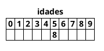
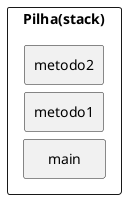

# Codificando com JAVA

Em geral, as linguagens de programação possuem convenções [^camel] para definir os nomes das variáveis. Essas convenções ajudam o desenvolvimento de um código mais legível.

Na convenção de nomes da linguagem Java, os nomes das variáveis devem seguir o padrão **camel case** com a primeira letra minúscula **(lower camel case).** Veja alguns exemplos:

- nomeDoCliente
- numeroDeAprovados

## Declarando e usando variáveis

Dentro de um bloco, podemos declarar variáveis e usá-las. Em Java, toda variável tem um tipo que não pode
ser mudado, uma vez que declarado:

```java
tipoDaVariavel nomeDaVariavel;
```

Por exemplo, é possível ter uma idade que guarda um número inteiro:


```java
int idade;
```

Com isso, você declara a variável idade, que passa a existir a partir daquela linha. Ela é do tipo int, que guarda um número inteiro. A partir daí, você pode usá-la, primeiramente atribuindo valores.

A linha a seguir é a tradução de: "idade deve valer quinze”.

```java
idade = 15;
```

Além de atribuir, você pode utilizar esse valor. O código a seguir declara novamente a variável idade com valor 15 e imprime seu valor na saída padrão através da chamada a System.out.println.

```java
// declara a idade
int idade;
idade = 15;

// imprime a idade
System.out.println(idade);
```

Por fim, podemos utilizar o valor de uma variável para algum outro propósito, como alterar ou definir uma segunda variável. O código a seguir cria uma variável chamada idadeNoAnoQueVem com valor de idade **mais um.**

```java
// calcula a idade no ano seguinte
int idadeNoAnoQueVem;
idadeNoAnoQueVem = idade + 1;
```

No mesmo momento que você declara uma variável, também é possível inicializá-la por praticidade:

```java
int idade = 15;
```

Você pode usar os operadores $+$, $-$, $/$ e $*$ para operar com números, sendo eles responsáveis pela adição, subtração, divisão e multiplicação, respectivamente. Além desses operadores básicos, há o operador % (módulo) que nada mais é que o **resto de uma divisão inteira.** Veja alguns exemplos:

```java
int quatro = 2 + 2;
int tres = 5 - 2;
int oito = 4 * 2;


int dezesseis = 64 / 4;
int um = 5 % 2; // 5 dividido por 2 dá 2 e tem resto 1;
                // o operador % pega o resto da divisão inteira
```

Representar números inteiros é fácil, mas como guardar valores reais, tais como frações de números inteiros e outros? Outro tipo de variável muito utilizado é o double, que armazena um número com ponto flutuante (e que também pode armazenar um número inteiro).
```java
double pi = 3.14;
double x = 5 * 10;
```

O tipo boolean armazena um valor verdadeiro ou falso, e só: nada de números, palavras ou endereços, como em algumas outras linguagens.

```java
boolean verdade = true;
```

`true` e `false` são palavras reservadas do Java. É comum que um boolean seja determinado através de uma expressão booleana, isto é, um trecho de código que retorna um booleano, como o exemplo:

```java
int idade = 30;
boolean menorDeIdade = idade < 18;
```

O tipo `char` guarda um, e apenas um, caractere. Esse caractere deve estar entre aspas simples. Não se esqueça dessas duas características de uma variável do tipo `char`! Por exemplo, ela não pode guardar um código como " pois o vazio não é um caractere!

```java
char letra = 'a';
System.out.println(letra);
```

Variáveis do tipo `char` são pouco usadas no dia a dia Veremos mais a frente o uso das Strings, que usamos constantemente, porém estas não são definidas por um tipo primitivo.


## Tipos primitivos e valores

Esses tipos de variáveis são tipos primitivos do Java: o valor que elas guardam são o real conteúdo da variável. Quando você utilizar o operador de atribuição `=` o valor será copiado.

```java
int i = 5; // i recebe uma cópia do valor 5
int j = i; // j recebe uma cópia do valor de i
i = i + 1; // i vira 6, j continua 5
```

Aqui, `i` fica com o valor de `6`. Mas e `j`? Na segunda linha, `j` está valendo `5`. Quando `i` passa a valer `6`, será
que `j` também muda de valor? Não, pois o valor de um tipo primitivo sempre é copiado.

Apesar da linha `2` fazer `j = i`, a partir desse momento essas variáveis não tem relação nenhuma: o que acontece com uma, não repete em nada com a outra

## O if e o else

A sintaxe do if no Java é a seguinte:
```java
if (condicaoBooleana) {
    codigo;
}
```
Uma **condição booleana** é qualquer expressão que retorne `true` ou `false`. Para isso, você pode usar os operadores `<`, `>`, `<=`, `>=` e outros. Um exemplo:

```java
int idade = 15;
if (idade < 18) {
    System.out.println("Não pode entrar");
}
```

Além disso, você pode usar a cláusula else para indicar o comportamento que deve ser executado no caso da expressão booleana ser falsa:
```java
int idade = 15;
if (idade < 18) {
    System.out.println("Não pode entrar");
} else {
    System.out.println("Pode entrar");
}
```
Você pode concatenar expressões booleanas através dos operadores lógicos "E" e "OU". O "E" é representado pelo `&&` e o "OU" é representado pelo `||`.

Um exemplo seria verificar se ele tem menos de 18 anos e se ele não é amigo do dono:
```java
int idade = 15;
boolean amigoDoDono = true;
if (idade < 18 && amigoDoDono == false) {
    System.out.println("Não pode entrar");
}
else {
    System.out.println("Pode entrar");
}
```
Esse código poderia ficar ainda mais legível, utilizando-se o operador de negação, o `!`. Esse operador transforma o resultado de uma expressão `booleana` de `false` para `true` e vice versa.

```java
int idade = 15;
boolean amigoDoDono = true;
if (idade < 18 && !amigoDoDono) {
    System.out.println("Não pode entrar");
} else {
    System.out.println("Pode entrar");
}
```

Perceba na linha 3 que o trecho `amigoDoDono == false` virou `!amigoDoDono`. Eles têm o mesmo valor.

Para comparar se uma variável tem o mesmo valor que outra variável ou valor, utilizamos o operador `==`. Perceba que utilizar o operador `=` dentro de um `if` vai retornar um erro de compilação, já que o operador `=` é o de atribuição.
```java
int mes = 1;
if (mes == 1) {
    System.out.println("Você deveria estar de férias");
}
```

## Loops

### O While
O while é um comando usado para fazer um laço (loop), isto é, repetir um trecho de código algumas vezes. A ideia é que esse trecho de código seja repetido enquanto uma determinada condição permanecer verdadeira.
```java
int idade = 15;
while (idade < 18) {
    System.out.println(idade);
    idade = idade + 1;
}
```

O trecho dentro do bloco do while será executado até o momento em que a condição `idade < 18` passe a ser `falsa`. E isso ocorrerá exatamente no momento em que `idade == 18`, o que não o fará imprimir `18`.

```java
int i = 0;
while (i < 10) {
    System.out.println(i);
    i = i + 1;
}
```

Já o while acima imprime de 0 a 9.

### O For
Outro comando de loop extremamente utilizado é o for. A ideia é a mesma do while: fazer um trecho de código ser repetido enquanto uma condição continuar verdadeira. Mas além disso, o for isola também um espaço para inicialização de variáveis e o modificador dessas variáveis. Isso faz com que fiquem mais legíveis,
as variáveis que são relacionadas ao loop:

```java
for (inicializacao; condicao; incremento) {
    codigo;
}
```

Um exemplo é o a seguir:

```java
for (int i = 0; i < 10; i = i + 1) {
    System.out.println("olá!");
}
```

Perceba que esse for poderia ser trocado por:

```java
int i = 0;
while (i < 10) {
    System.out.println("olá!");
    i = i + 1;
}
```


Porém, o código do for indica claramente que a variável `i` serve, em especial, para controlar a quantidade de laços executados. Quando usar o for? Quando usar o while? Depende do gosto e da ocasião.

### Controlando loops

Apesar de termos condições booleanas nos nossos laços, em algum momento, podemos decidir parar o loop por algum motivo especial sem que o resto do laço seja executado.
```java
int x = 100;
int y = 200;    
for (int i = x; i < y; i++) {
    if (i % 19 == 0) {
        System.out.println("Achei um número divisível por 19 entre x("+x+") e y("+y+")");
        System.out.println(i);
        break;
    }
}
```
O código acima vai percorrer os números de `x` a `y` e parar quando encontrar um número divisível por `19`, uma vez que foi utilizada a palavra chave **break.**

Da mesma maneira, é possível obrigar o loop a executar o próximo laço. Para isso usamos a palavra chave **continue.**
```java
for (int i = 0; i < 100; i++) {
    if (i > 50 && i < 60) {
        continue;
    }
    System.out.println(i);
}
```
::: warning ?
O código acima não vai imprimir alguns números. (Quais exatamente?)
:::

## Escopos e Blocos

### Escopo das variáveis
No Java, podemos declarar variáveis a qualquer momento. Porém, dependendo de onde você as declarou, ela vai valer de um determinado ponto a outro.

```java
// aqui a variável i não existe
int i = 5;
// a partir daqui ela existe
``` 

O **escopo da variável** é o nome dado ao trecho de código em que aquela variável existe e onde é possível acessá-la.

Quando abrimos um novo bloco com as chaves, as variáveis declaradas ali dentro **só valem até o fim daquele bloco**.

```java
// aqui a variável i não existe
int i = 5;
// a partir daqui ela existe
while (condicao) {
    // o i ainda vale aqui
    int j = 7;
    // o j passa a existir
}
// aqui o j não existe mais, mas o i continua dentro do escopo
```

No bloco acima, a variável `j` para de existir quando termina o bloco onde ela foi declarada. Se você tentar acessar uma variável fora de seu escopo, ocorrerá um erro de compilação.

O mesmo vale para um if:
```java
if (algumBooleano) {
    int i = 5;
} else {
    int i = 10;
}
System.out.println(i); // cuidado!
```

Aqui a variável `i` não existe fora do `if` e do `else`! Se você declarar a variável antes do `if`, vai haver outro erro
de compilação: dentro do `if` e do `else` a variável está sendo redeclarada! Então o código para compilar e fazer sentido fica:

```java
int i;
if (algumBooleano) {
    i = 5;
} else {
    i = 10;
}
System.out.println(i);
```

Uma situação parecida pode ocorrer com o for:
```java 
for (int i = 0; i < 10; i++) {
    System.out.println("olá!");
}
System.out.println(i); // cuidado!
```
Neste for, a variável i morre ao seu término, não podendo ser acessada de fora do for, gerando um erro de
compilação. Se você realmente quer acessar o contador depois do loop terminar, precisa de algo como:
```java 
int i;
for (i = 0; i < 10; i++) {
    System.out.println("olá!");
}
System.out.println(i);
```

### Um bloco dentro do outro

Um bloco também pode ser declarado dentro de outro. Isto é, um `if` dentro de um `for`, ou um `for` dentro de um `for`, algo como:

```java 
while (condicao) {
    for (int i = 0; i < 10; i++) {
    // código
    }
}
```

## Array 

[^caelumoo]

### O problema

Dentro de um bloco, podemos declarar diversas variáveis e usá-las:
```java
int idade1;
int idade2;
int idade3;
int idade4;
```

Isso pode se tornar um problema quando precisamos mudar a quantidade de variáveis a serem declaradas de acordo com um parâmetro. Esse parâmetro pode variar, como por exemplo, a quantidade de número contidos num bilhete de loteria. Um jogo simples possui 6 números, mas podemos comprar um bilhete mais caro, com 7 números ou mais.

Para facilitar esse tipo de caso podemos declarar um **vetor (array)** de inteiros:

```java
int[] idades = new int[10];
```

O que fazemos foi criar uma array de int de 10 posições e atribuir o endereço no qual ela foi criada. Podemos ainda acessar as posições do array:

```java
idades[5] = 8;
```
<figure>


<figcaption>Representação do vetor idade.</figcaption>
</figure>

O código acima altera a sexta posição do array. No Java, os índices do array vão de 0 a n-1, onde n é o tamanho dado no momento em que você criou o array. 

::: danger
Se você tentar acessar uma posição fora desse alcance, um erro ocorrerá durante a execução.
:::

[^k19oo]

- Em Java, os arrays são criados através do comando new.

```java
int[] numeros = new int[100];
```

A variável `numeros` armazena a referência de um array criado na memória do computador através
do comando `new`. Na memória, o espaço ocupado por esse array está dividido em 100 "pedaços"
iguais numerados de 0 até 99. Cada "pedaço" pode armazenar um valor do tipo int.

### Modificando o conteúdo de um array

Para modificar o conteúdo de um array, devemos escolher uma ou mais posições que devem ser alteradas e utilizar a sintaxe abaixo:

```java
int[] numeros = new int[100];
numeros[0] = 136;
numeros[99] = 17;
```

Também podemos definir os valores de cada posição de um array no momento da sua criação utilizando as sintaxes abaixo:

```java
int[] numeros = new int[]{100 ,87};
int[] numeros = {100 ,87};
```


### Acessando o conteúdo de um array


Para acessar o conteúdo de um array, devemos escolher uma ou mais posições e utilizar a sintaxe abaixo:

```java
int[] numeros = {100 ,87};
System.out.println(numeros[0]);
System.out.println(numeros[1]);
```


### Percorrendo um Array

Quando trabalhamos com um array, uma das tarefas mais comuns é acessarmos todas ou algumas de suas posições sistematicamente. Geralmente, fazemos isso para resgatar todos ou alguns dos valores armazenados e realizar algum processamento sobre tais informações. Para percorrermos um array, utilizaremos a instrução de repetição `for`. Podemos utilizar a instrução `while` também. Porém, logo perceberemos que a sintaxe da instrução `for`, em geral, é mais apropriada quando estamos trabalhando com arrays.

```java
int[] numeros = new int[100];
for(int i = 0; i < 100; i ++) {
    numeros[i] = i ;
}
```

Para percorrer um array, é necessário saber a quantidade de posições do mesmo. Essa quantidade é definida quando o array é criado através do comando new. Nem sempre essa informação está explícita no código. Por exemplo, considere um método que imprima na saída padrão os valores armazenados em um array. Provavelmente, esse método receberá como parâmetro um array e a quantidade de posições desse array não estará explícita no código fonte.

```java
void imprimeArray (int[] numeros ) {
    // implementação
}
```

Podemos recuperar a quantidade de posições de um array acessando o seu atributo `length`.

```java
void imprimeArray (int[] numeros ) {
    for(int i = 0; i < numeros.length; i++) {
        System.out.println(numeros[i]) ;
    }
}
```


### foreach

Para acessar todos os elementos de um array, é possível aplicar o comando for com uma sintaxe um pouco diferente.

<code-group>
<code-block title="Foreach">

```java
void imprimeArray (int[] numeros ) {
    for(int numero : numeros ) {
        System.out.println(numero) ;
    }
}
```

</code-block>

<code-block title="Equivalente">

```java
void imprimeArray (int[] numeros ) {
    for(int i = 0; i < numeros.length; i++) {
        int numero = numeros[i];
        System.out.println(numero);
    }
}
```

</code-block>
</code-group>


### Operações

Nas bibliotecas da plataforma Java, existem métodos que realizam algumas tarefas úteis relacionadas a arrays. Veremos esses métodos a seguir.

#### Ordenando um Array

Considere um array de String criado para armazenar nomes de pessoas. Podemos ordenar esses nomes através do método `Arrays.sort()`.

```java
String[] nomes = new String[]{"rafael cosentino", "jonas hirata", "marcelo martins"};
Arrays.sort(nomes);

for( String nome : nomes ) {
    System.out.println(nome);
}
```

Analogamente, também podemos ordenar números.

#### Duplicando um Array

Para copiar o conteúdo de um array para outro com maior capacidade, podemos utilizar o método `Arrays.copyOf()`.

```java
String[] nomes = new String[] {"rafael", "jonas", "marcelo"};
String[] nomesDuplicados = Arrays.copyOf( nomes , 10) ;
```

#### Preenchendo um Array

Podemos preencher todas as posições de um array com um valor específico utilizando o método `Arrays.fill()`.

```java
int[] numeros = new int[10];
java.util.Arrays.fill(numeros,5) ;
```

## Entrada e Saida de Dados


Quando falamos em entrada e saída, estamos nos referindo a qualquer troca de informação entre uma aplicação e o seu exterior.

A leitura do que o usuário digita no teclado, o conteúdo obtido de um arquivo ou os dados recebidos pela rede são exemplos de entrada de dados. A impressão de mensagens no console, a escrita de texto em um arquivo ou envio de dados pela rede são exemplos de saída de dados.

A plataforma Java oferece diversas classes e interfaces para facilitar o processo de entrada e saída. Em determinadas situações, uma aplicação precisa fazer a entrada e saída byte a byte mas, nem sempre isso é necessário. Sendo assim, é mais simples utilizar a classe `Scanner` do pacote `java.util` do Java. Essa classe possui métodos mais sofisticados para obter os dados de uma entrada.

Veja um exemplo de leitura do teclado com a classe Scanner:

```java
import java.util.Scanner;

public class TestaDeclaracaoScanner {
  public static void main(String[] args) {
    //Lê a partir da linha de comando
    Scanner teclado = new Scanner(System.in);

    //Lendo um valor inteiro:
    int n;

    System.out.printf("Informe um número para a tabuada: ");
    n = teclado.nextInt();
    
    //Lendo um valor real:
    float preco;

    System.out.printf("Informe o preço da mercadoria = R$ ");
    preco = teclado.nextFloat();
    
    //	Lendo um valor real:
    double salario;

    System.out.printf("Informe o salário do Funcionário = R$ ");
    salario = teclado.nextDouble();
    
    //	Lendo uma String, usado na leitura de palavras simples que não usam o caractere de espaço (ou barra de espaço):
    String s;

    System.out.printf("Informe uma palavra simples:\n");
    s = teclado.next();
    
    //	Lendo uma String, usado na leitura de palavras compostas, por exemplo, Pato Branco:
    String s;

    System.out.printf("Informe uma cadeia de caracteres:\n");
    s = teclado.nextLine();
    
    //	Na leitura consecutiva de valores numéricos e String deve-se esvaziar o buffer do teclado antes da leitura do valor String, por exemplo:
    int n;
    String s;

    System.out.printf("Informe um Número Inteiro: ");
    n = teclado.nextInt();

    teclado.nextLine(); // esvazia o buffer do teclado

    System.out.printf("Informe uma cadeia de caracteres:\n");
    s = teclado.nextLine();
    
  }
}
```

### JOptionPane

[^Bacala]


- Até agora vimos o método `System.out.println` para escrever informações na tela (console).
- A linguagem Java oferece diversas formas de interação com o usuário, a grande maioria em janelas.
- Para evitar a criação de uma interface completa, pode-se utilizar as chamadas caixas de diálogo. 

- JOptionPane Oferece caixas de diálogo predefinidas que permitem aos programas exibir mensagens aos usuários;


- exibir uma caixa de mensagem para informar o usuário, usamos o método showMessageDialog(...): 

```java
import javax.swing.JOptionPane;
public class Main {
    public static void main (String arg[]) {
        JOptionPane.showMessageDialog(null, "Olá JOptionPane");
        System.exit(0); 
    } 
} 
```
[Veja Rodando](https://replit.com/@LeandroIFBA/JOptionPane#Main.java)

- Há uma outra forma de chamada para o método showMessageDialog, a qual permite melhorarmos o visual da caixa de mensagem: 

```java
JOptionPane.showMessageDialog(null,"Esta é uma mensagem", "Atenção",  JOptionPane.WARNING_MESSAGE);
```

- JOptionPane.PLAIN_MESSAGE
    - nenhum ícone
- JOptionPane.ERROR_MESSAGE
    - ícone de erro
- JOptionPane.INFORMATION_MESSAGE
    - ícone de informação
- JOptionPane.WARNING_MESSAGE
    - ícone de aviso
- JOptionPane.QUESTION_MESSAGE
    - ícone de interrogação

#### System.exit

```java
//...
System.exit(0);
//...

```

- System.exit(0) é necessário em programas com interface gráfica, terminando o aplicativo Java.
- O retorno Zero('0') para o método exit() indica que o programa finalizou com sucesso.
- Valores diferentes de zero significam erros na execução e podem ser tratados por aplicativos que chamaram o programa Java.

### showInputDialog

- Exibir uma caixa de entrada
- Retorna sempre a String digitada pelo usuário. 

```java
String nome;
nome = JOptionPane.showInputDialog("Digite o seu nome");
JOptionPane.showMessageDialog(null,"Seu nome é "+nome);
```

- Variação mais completa:
```java
nome = JOptionPane.showInputDialog(null, "Por favor, digite o seu nome", "Atenção", JOptionPane.INFORMATION_MESSAGE);
```


## Conversões em Java

[^DevMediaConv]

### Convertendo ASCII para String

Você pode converter códigos ASCII para String utilizando o método `toString()`, de acordo com o código abaixo:

```java
int i = 64;
String aChar = new Character((char)i).toString();
```

### Convertendo números em decimal para binário

É possível fazer a conversão de números na base hexadecimal para binário através do método `toBinaryString()`, como pode ser visto a seguir:

```java
int i = 42;
String binstr = Integer.toBinaryString(i);
```

### Convertendo um Double para um String

Você pode converter um variável do tipo `double` para um `String` usando o método `toString()` da classe `Double`, como apresentado a seguir:

```java
double i = 42.0;
String str = Double.toString(i);
```

### Convertendo um float para um String

Da mesma forma que a conversão do `Double`, você utiliza o método `toString()` da classe `Float`.

```java
float f = 12.0f;
String str = Float.toString(f);
```

### Convertendo um integer para código ASCII

Veja como fazer a conversão de um integer para ASCII:

```java
int i = (int) c; // Você terá o valor 65
char c = 'A';
```


### Convertendo de um integer para uma String

Veja no código abaixo duas formas de fazer a conversão de um `integer` para uma `String`:

```java
int i = 42;
String str = Integer.toString(i);
//ou
String str = "" + i ;
```

### Convertendo de um long para uma String

Você pode fazer a conversão de `long` para `String` através do método `toString` da classe `Long`.

```java
long l = 42;
String str = Long.toString(l);
```

### Convertendo de uma String para Double

Você pode converter um `String` para `double` utilizando o método `valueOf()` e `doubleValue()` da classe `Double`, como mostrado no trecho abaixo.

```java
double d = Double.valueOf(str).doubleValue();
```

### Convertendo String para integer

Faça a conversão de um `String` para integer usando o método `parseInt()` da classe `Integer`, ou usando os métodos `valueOf()` e `intValue()` da classe `Integer` combinados, como mostra o código a seguir.

```java
str = "25";
int i = Integer.valueOf(str).intValue();

//ou

int i = Integer.parseInt(str);
```

### Convertendo uma String para um float

Converta um String para float através da combinação dos métodos `valueOf()` e `floatValue()` da classe `Float`.

```java
float f = Float.valueOf(str).floatValue();
```

### Convertendo uma String para um long

Você pode fazer a conversão de um String para long usando o método parseLong() da classe Long, ou utilizando a combinação dos métodos `valueOf()` e `longValue()` também da classe `Long`.

```java
long l = Long.valueOf(str).longValue();
//ou
long l = Long.parseLong(str);
```

## Enum

[^Jenkov]

Um Java Enum é um tipo especial do Java usado para definir coleções de constantes. Mais precisamente, um tipo de enum Java é um tipo especial de classe Java. Um enum pode conter constantes, métodos, etc. Enums Java foram adicionados no Java 5.

### Exemplo Enum

Aqui está um exemplo simples de enum Java:

```java
public enum Level {
    HIGH,
    MEDIUM,
    LOW
}
```
Observe a palavra `enum` é usada no lugar de `class` ou `interface`. A palavra-chave enum em Java sinaliza ao compilador Java que essa definição de tipo é um enum.

Você pode se referir às constantes no enum acima assim:

```java
Level level = Level.HIGH;
```

Observe como a variável level é do tipo Level que é o tipo enum Java definido no exemplo acima. A variável level pode tomar uma das Level constantes enum como valor ( HIGH, MEDIUM ou LOW). Nesse caso, level é definido como HIGH.

```java
public enum OpcoesMenu {
    SALVAR(1), IMPRMIR(2), ABRIR(3), VISUALIZAR(4), FECHAR(5);

    private final int valor;
        OpcoesMenu(int valorOpcao){
        valor = valorOpcao;
    }
    public int getValor(){
        return valor;
    }
}
```

https://www.devmedia.com.br/tipos-enum-no-java/25729

## Pilha de Execução

```java
class TestePilha {
    public static void main(String[] args) {
        System.out.println("inicio do main");
        metodo1();
        System.out.println("fim do main");
    }
    static void metodo1() {
        System.out.println("inicio do metodo1");
        metodo2();
        System.out.println("fim do metodo1");
    }
    static void metodo2() {
        System.out.println("inicio do metodo2");
        int[] array = new int[10];
        for (int i = 0; i < 10; i++) {
            array[i] = i;
            System.out.println(i);
        }
        System.out.println("fim do metodo2");
    }
}
```


- O método `main` chama `metodo1`
- O método `metodo1` chama o `metodo2`

Cada um desses métodos pode ter suas próprias variáveis locais, sendo que, por exemplo, o `metodo1` não enxerga as variáveis declaradas dentro do `main`

Toda invocação de método é empilhada em uma estrutura de dados que isola a área de memória de cada um. Quando um método termina (retorna), ele volta para o método que o invocou. Ele descobre isso através da pilha de execução **(stack)**


<figure>



<figcaption>Representação de uma pilha de execução.</figcaption>
</figure>

## Exercícios

- [Exercício W3C](exercicios/00_exercicio_java_w3c.md)
- [Exercício sintaxe ](exercicios/01_exercicio_java_caelum.md)

## PodCast

- [Mitos e verdades sobre Java](https://podcasts.google.com/feed/aHR0cHM6Ly9hbmNob3IuZm0vcy80NzE0YzBjMC9wb2RjYXN0L3Jzcw/episode/dGFnOnNvdW5kY2xvdWQsMjAxMDp0cmFja3MvODk5Njg4MDk3?ep=14)


## Referências

<!-- @include: ../bib/bib.md -->
