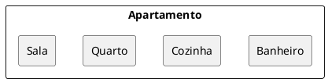
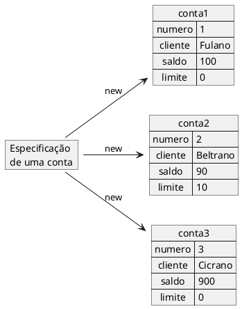
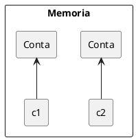
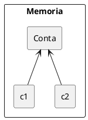
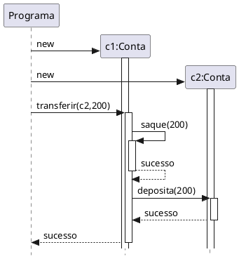

# Objeto
[^caelumoo]

- Um objeto é cada uma das entidades identificáveis num dado domínio de aplicação
- Em um sistema Bancário teríamos objetos do tipo: Cliente, Conta, Conta Corrente, Dependente, etc.
- Um objeto também pode ser visto como um agregado de outros objetos (suas partes)

<figure>



<figcaption> Um objeto como um conjuto de outros objetos.</figcaption>
</figure>


- Um Objeto é uma entidade independente que armazena dados, encapsula serviços, troca mensagens com outros objetos e é modelado para executar as funções do sistema
- Um Objeto pode ser descrito pela identificação de dois elementos básicos: estrutura e comportamento

::: tip Exemplo 
Objeto do tipo **Pessoa**
- **Estrutura** : nome, cpf, idade
- **Comportamento** : trabalhar, descansar
:::

::: tip Exemplo
Objeto do tipo **Conta**
- **Estrutura:** titular, código, saldo
- **Comportamento:** debitarValor, adicionarValor
:::

## Mensagens

- São estímulos enviados aos objetos solicitando que alguma operação seja realizada por um dado objeto
  - Nome da mensagem
  - Parâmetros
- Especifica O QUE deve ser feito
- O comportamento de um objeto é dado pelo conjunto de mensagens que ele pode responder
  
## Características dos Objetos
- Único
- Possui atributos que definem caraterísticas e/ou estado 
- Possuem capacidade de realizar ações que chamamos de métodos ou funções
- Normalmente se diz que um objeto é uma instância de uma Classe.
- O que é uma Classe ?


# Classe
[^caelumoo]
## Origem do termo
- A palavra classe vem da taxonomia da biologia. 
  - Todos os seres vivos de uma mesma classe biológica têm uma série de atributos e comportamentos em comum, mas não são iguais, podem variar nos valores desses atributos e como realizam esses comportamentos.
- Homo Sapiens define um grupo de seres que possuem características em comum
  - Homo Sapiens é um ser humano?
  - Tudo está especificado na classe Homo Sapiens, mas se quisermos mandar alguém correr, comer, pular, precisaremos de uma instância de Homo Sapiens, ou então de um objeto do tipo Homo Sapiens.
## Analogias
- Uma receita de bolo. 
  - Você come uma receita de bolo? 
    - Precisamos instaciá-la, criar um objeto bolo a partir dessa especificação (a classe) para utilizá-la. 
    - Podemos criar centenas de bolos a partir dessa classe (a receita, no caso), eles podem ser bem semelhantes, alguns até idênticos, mas são objetos diferentes.
- A planta de uma casa é uma casa?...
## Conceito
- Uma classe é uma descrição de um conjunto que compartilham os mesmos atributos(características), operações, relacionamentos e semântica
- Todos os objetos são instâncias de classes, onde a classe descreve as propriedades e comportamentos daquele objeto
- **Atributos** são propriedades de uma classe, que descreve um intervalo de valores que as instâncias podem apresentar. Uma Classe pode ter qualquer número de atributos ou nenhum
- **Operações** correspondem aos processos que a classe pode realizar
  
<figure>



<figcaption> Representação de vários objetos de uma mesma estrutura.</figcaption>
</figure>


 - Estrutura (molde) que define os atributos e/ou estados de um conjunto de objetos com características similares.
 - Define o comportamento de seus objetos (ações que o objeto pode fazer) através de métodos. 
 - Descreve os serviços (ações) providos por seus objetos 
 - Quais informações eles podem armazenar

```java
class Conta{
  int numero;
  String cliente;
  double saldo;
  double limite;
}
```

### Usando a classe

```java
class Programa{
  public static void main(String[] args){
    new Conta();
  }
}
```

- Objeto criado, mas como acessar?


```java
class Programa{
  public static void main(String[] args){
    Conta minhaConta;
    minhaConta = new Conta();
  }
}
```
- Através da variável minhaConta, podemos acessar o objeto recém criado para alterar seu cliente, seu saldo, etc

```java
class Programa{
  public static void main(String[] args){
    Conta minhaConta;
    minhaConta = new Conta();

    minhaConta.cliente = "Leandro";
    minhaConta.saldo = 10.0;

    System.out.println("Saldo atual: "+minhaConta.saldo);
  }
}
```


## Atributos de uma Classe


- Caraterísticas e/ou estado de uma classe
- Após a classe ser instanciada em um objeto os atributos vão receber valores (caraterísticas e/ou estados) que definem o objeto

```java{2-5}
class Conta{
  int numero;//atributo
  String cliente;//atributo
  double saldo;//atributo
  double limite;//atributo
}
```


## Métodos de uma Classe


- Conjunto de ações que um determinado objeto pode executar
- Definem o que um objeto pode fazer
- São acionados por outros objetos
  - Os objetos se comunicam através de métodos
  - Troca de mensagens

- Um método que saca uma determinada quantidade e não devolve nenhuma informação para quem acionar esse método

```java{7-10}
class Conta{
  int numero;
  String cliente;
  double saldo;
  double limite;

  void saca(double quantidade){//método
    double novoSaldo = this.saldo - quantidade;
    this.saldo = novoSaldo;
  }
}
```

 - Fazer um depósito
```java{7-10,12-14}
class Conta{
  int numero;
  String cliente;
  double saldo;
  double limite;

  void saca(double quantidade){//método
    double novoSaldo = this.saldo - quantidade;
    this.saldo = novoSaldo;
  }

  void deposita(double quantidade){//método
    this.saldo += quantidade;
  }
}
```


```java
class Programa{
  public static void main(String[] args){
    Conta minhaConta;
    minhaConta = new Conta();

    minhaConta.cliente = "Leandro";
    minhaConta.saldo = 100.0;

    //saca 20
    minhaConta.saca(20);
    //deposita 50
    minhaConta.deposita(50);

    System.out.println("Saldo atual: "+minhaConta.saldo);
  }
}
```


- Método com retorno
  - No caso do nosso método saca, podemos devolver um valor booleano indicando se a operação foi bem sucedida.


```java
class Conta{
  //...

  boolean saca(double valor){
    if(this.saldo<valor){
      return false;
    }else{
      this.saldo -= valor;
      return true;
    }
  }

}
```

```java
class Programa{
  public static void main(String[] args){
    //... 
    minhaConta.saldo = 100.0;

    boolean consegui=minhaConta.saca(20);
    if(consegui){
      System.out.println("Consegui sacar");
    }else{
      System.out.println("Não consegui sacar");
    }
  }
}
```

## Referência ao Objeto

```java
class Programa{
  public static void main(String[] args){
    Conta c1;
    c1 = new Conta();
    Conta c2;
    c2 = new Conta();
  }
}
```

- c1 uma variável que "aponta" para o objeto(referência).

<figure>



<figcaption> Representação da memória com duas instancias de Conta.</figcaption>
</figure>


```java
class Programa{
  public static void main(String[] args){
    Conta c1;
    c1 = new Conta();
    Conta c2 = c1;    
  }
}
```

<figure>



<figcaption> Representação da memória com apenas uma instancia de Conta.</figcaption>
</figure>

::: warning ?
Como seria a transferência de valores entre duas contas?
:::

<figure>



<figcaption>Diagram de sequencia para a transferência entre contas</figcaption>
</figure>

### Comparando

```java
public static void main(String args[]) {
  Conta c1 = new Conta();
  c1.cliente = "Leandro";    
  c1.saldo = 100.0;    
  Conta c2 = new Conta();    
  c2.cliente = "Leandro";    
  c2.saldo = 100.0;    
  if (c1 == c2) {
    System.out.println("Contas iguais");    
  }
}
```

- O operador `==` compara o conteúdo das variáveis
  - variáveis não guardam o objeto, e sim o endereço em que ele se encontra (referência)
  - As contas podem ser equivalentes no nosso critério de igualdade, porém elas não são o mesmo objeto.


#### equals

```java
public static void main(String args[]) {
  Conta c1 = new Conta();
  c1.cliente = "Leandro";    
  c1.saldo = 100.0;    
  Conta c2 = new Conta();    
  c2.cliente = "Leandro";    
  c2.saldo = 100.0;    
  if (c1.equals(c2)) {
    System.out.println("Contas iguais");    
  }
}
```

```java
class Conta {
  //...
  public boolean equals(Conta outraConta) {
    return this.cliente.equals(outraConta.cliente) && this.saldo == outraConta.saldo;
  }
  //...
  
}
```


## Referências

@include(../bib/bib.md)
