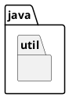
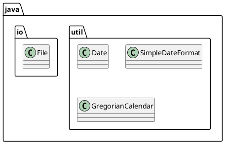

# Pacotes
- Forma de organizar classes dentro de uma estrutura de árvores. 
- Podemos entender a estrutura de árvores como os diretórios do sistema operacional. 
- O nome completo de uma classe é definido pelo seu pacote e o nome. 
- Organiza suas classes e bibliotecas
    - Os diretórios estão diretamente relacionados aos chamados pacotes e costumam agrupar classes de funcionalidade parecida
- No pacote java.util por exemplo, temos as classes Date, SimpleDateFormat e GregorianCalendar; todas elas trabalham com datas de formas diferentes
    - Significa que essas classes estão no diretório java/util/

```plantuml
@startuml
@startsalt
{
    {T
        + java
        ++ util
        +++ Date
    }
}
@endsalt
@enduml
```

<figure>



<figcaption>Representação da estrutura de diretório.</figcaption>
</figure>

- A palavra chave *package* indica qual pacote que contém a classe

```java
package java.util;
```

- Para usar uma classe ou um pacote você precisa usar a import palavra-chave:

```java
import pacote.Class;   // Importa uma única classe
import pacotenovo.*;   // Importa todas as classes do pacote
```
<figure>
<div class="multicolumn">




</div>
<figcaption>Visualizações diferentes de subpacotes</figcaption>
</figure>

- O nome da classe na verdade para o compilador é
    - java.util.Date
    - java.util.SimpleDateFormat
    - java.util.GregorianCalendar
    - java.io.File

<figure>



<figcaption>Representação de classes em seus pacotes.</figcaption>
</figure>

## Importar uma classe

Se você encontrar uma classe que deseja usar, por exemplo, a classe *Scanner*, que é usada para obter a entrada do usuário, escreva o seguinte código:

```java
import java.util.Scanner;
```
No exemplo acima, *java.util* é um pacote, enquanto *Scanner* é uma classe do pacote *java.util*.

Para usar a classe *Scanner*, crie um objeto da classe e use qualquer um dos métodos disponíveis encontrados na documentação da classe *Scanner*. Em nosso exemplo, usaremos o método *nextLine()*, que é usado para ler uma linha completa:

```java
import java.util.Scanner;
class Main {
  public static void main(String[] args) {
    Scanner scanner = new Scanner(System.in);
    System.out.println("Informe o nome");
    String nome = scanner.nextLine();
    System.out.println("nome é : " + nome);
  }
}
```
### Usar uma classe sem import

Para utilizar uma classe sem a palavra reservada `import` você pode referenciar a classe pelo nome completo (pacote.nomeClasse). Exemplo:

```java{3}
class Main {
  public static void main(String[] args) {
    java.util.Scanner scanner = new java.util.Scanner(System.in);
    System.out.println("Informe o nome");
    String nome = scanner.nextLine();
    System.out.println("nome é : " + nome);
  }
}
```