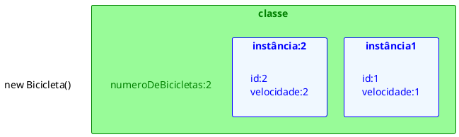

# Membros de instância e Membros de classes

[^Takenami]

- Variáveis de Classe
  - Quando um número de objetos são criados a partir de uma mesma classe, cada um tem suas próprias cópias distintas de variáveis de instância. 
  - No caso de a classe de bicicleta, são as variáveis de instância engrenagem e velocidade. Cada objeto de bicicleta tem seus próprios valores para essas variáveis, armazenadas em diferentes locais de memória.
- Às vezes, é necessário ter variáveis que são comuns a todos os objetos. 
- Isto é conseguido com o modificador `static`. 
- Os campos que têm o modificador `static` em sua declaração são chamados de **campos estáticos ou variáveis de classe.** 
- Eles estão associados com a classe. Cada instância compartilha uma variável de classe, que está em um local fixo na memória. 
- Qualquer objeto pode alterar o valor de uma variável de classe, mas variáveis de classe também pode ser manipulado sem criar uma instância da classe.
  - exemplo:
    - Caso seja necessário criar um número de objetos de bicicleta e atribuir a cada um número de série, começando com 1 para o primeiro objeto. 
    - Esse número de identificação é única para cada objeto e é, portanto, uma variável de instância. 
    - Ao mesmo tempo, você precisa de um campo para manter o controle de quantos objetos bicicletas foram criadas para que você saiba o ID para atribuir ao próximo. 
    - Esse campo não está relacionada a qualquer objeto individual, mas para a classe como um todo. 
    - Para isso, você precisa de uma variável de classe, numeroDeBicicletas:

```java
public class Bicicleta {
  private int engrenagem;
  private int velocidade;
  private int id;
  private static int numeroDeBicicletas = 0;
  ...
}
```
- Variáveis de classe são referenciados pelo próprio nome da classe:
  ```java
  Bicicleta.numeroDeBicicletas
  ```
- Também é possível consultar a campos estáticos com uma referência de objeto como:
  ```java
  Bicicleta minhaBicicleta = new Bicicleta();
  minhaBicicleta.numeroDeBicicletas;
  ```
  mas isso não deixa claro que é um atributo de classe e não de instancia, é recomendado que sempre que for acessar um atributo de classe acessar pela classe.

- No construtor da Bicicleta pode ser setado o valor do atributo ID incrementar a variável de classe numeroDeBicicletas:
```java
public class Bicicleta {
  ... 
  private static int numeroDeBicicletas = 0;
  public Bicicleta(){
    this.id = ++numeroDeBicicletas;
  }
  public int getID() {
    return id;
  }
}
```

```java
public class Main {
    public static void main (String arg[]) {
      Bicicleta bicicleta1 = new Bicicleta();
      bicicleta1.setVelocidade(1);
      Bicicleta bicicleta2 = new Bicicleta();
      bicicleta2.setVelocidade(2);
    }
}
```

<figure>



<figcaption>Atributos de classe e de instância.</figcaption>
</figure>

## Métodos estáticos
- A linguagem de programação Java suporta métodos estáticos, bem como variáveis estáticas. 
- Os métodos estáticos, que têm o modificador static em suas declarações, deve ser chamado com o nome da classe, sem a necessidade de criação de uma instância da classe

```java
ClassName.methodName(args)
```

- Um uso comum para métodos estáticos é acessar campos estáticos. Por exemplo, nós poderíamos adicionar um método estático para a classe de bicicleta para acessar o campo estático numeroDeBicicletas:

```java{10-12}
public class Bicicleta {
  //... 
  private static int numeroDeBicicletas = 0;
  public Bicicleta(){
    this.id = ++numeroDeBicicletas;
  }
  public int getID() {
    return id;
  }
  public static int getNumeroDeBicicletas() {
    return numeroDeBicicletas;
  }
}

```
- Nem todas as combinações de variáveis e métodos de classe e de instância são permitidas:
  - Métodos de instância podem acessar variáveis de instância e métodos de instância diretamente.
  - Métodos de instância podem acessar variáveis de classe e métodos de classe diretamente.
  - Métodos de classe podem acessar variáveis de classe e métodos de classe diretamente.
  - Métodos de classe não podem acessar variáveis de instância ou métodos de instância diretamente, eles devem usar uma referência de objeto. Além disso, métodos de classe não pode usar a palavra-chave `this`.

## Constantes

- O modificador *static,* em combinação com o modificador *final,* é também usado para definir constantes. 
- O modificador *final* indica que o valor deste campo não pode mudar.

### Static final

- Por exemplo, a seguinte declaração variável define uma constante chamada PI, cujo valor é uma aproximação do pi

```java
static final double PI = 3.141592653589793;
```

- Constantes definidas desta forma não pode ser alteradas, um erro de compilação ocorrerá caso seu programa tenta fazer isso. 
- Por convenção, os nomes das constantes estão escritas em letras maiúsculas. 
- Se o nome for composto por mais de uma palavra, as palavras são separadas por um sublinhado (_).


## Referências

<!-- @include: ../bib/bib.md -->
