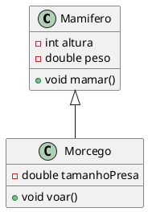
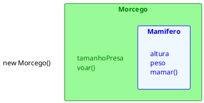
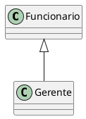
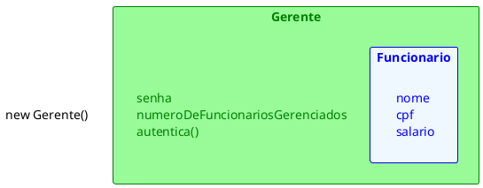
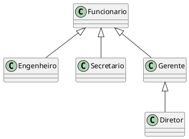
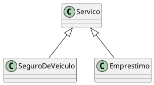
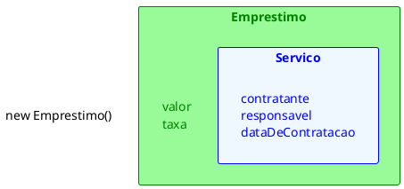
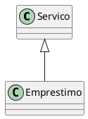
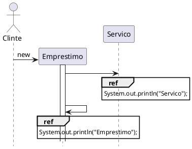

# Herança

[^Takenami]

- É a capacidade de uma classe definir o seu comportamento e sua estrutura aproveitando definições de outra classe, normalmente conhecida como classe base ou classe pai
    - As subclasses herdam tudo o que a classe pai possui e acrescenta as suas características particulares
    - Através do mecanismo de herança é possível definirmos classes genéricas que agreguem um conjunto de definições comuns a um grande número de objetos(Generalização) 
    - A partir destas especializações genéricas podemos construir novas classes, mais específicas, que acrescentem novas características e comportamentos aos já existentes (Especialização)

- Capacidade que uma classe tem de herdar as características e comportamentos de outra classe
- Classe pai é chamada de superclasse e a filha de subclasse
- Em Java só é permitido herdar de uma única classe, ou seja, não permite herança múltipla
- O objetivo da herança é especializar o entendimento de uma classe criando novas características e comportamentos que vão além da superclasse 
- Ao mesmo tempo que a especialização amplia o entendimento de uma classe, a generalização vai no sentido inverso e define um modelo menos especializado  e  mais genérico


```java
public class Mamifero{
    private int altura;
    private double peso;
    public void mamar(){
        System.out.println("Mamifero mamando");
    }
}
```

```java
public class Morcego extends Mamifero{
    private double tamanhoPresa;
    public void voar(){
        System.out.println("Morcego voando");
    }
}
```
- Classe Morcego
    - Quais as características de morcego?
        - altura
        - peso
        - tamanhoPresa
    - Quais ações o morcego pode fazer?
        - mamar
        - voar
- Se usarmos os princípios de lógica podemos dizer que todo morcego é mamífero porém NÃO podemos afirmar que todo mamífero é morcego

```java
Mamifero animalMamifero = new Morcego();
Morcego batman = new Mamifero();//erro
```

- Com base no que foi dito até aqui podemos deduzir que o item 2 deve causar um erro já que não é possível garantir que todo mamífero seja um morcego
- Já o item 1 pode parecer estranho, pois a variável é do tipo Mamífero e o objeto para o qual a variável se refere é do tipo Morcego
    - Devemos saber que toda variável pode receber um objeto que seja compatível com o seu tipo e neste caso todo Morcego CERTAMENTE **é um** Mamífero

```java
Mamifero animalMamifero = new Morcego();
animalMamifero.mamar();
animalMamifero.voar();//erro
```
- Todo `Morcego` **é um** `Mamifero`, porem não pode realizar todas as ações de um `morcego`
- A variável `animalMamifero` que recebe o objeto é do tipo `Mamifero`
- Para o `Morcego` `voar` é necessário criar uma nova variável do tipo `Morcego` e atribuir o objeto que estava na variável `animalMamifero`
```java
Mamifero animalMamifero = new Morcego();
animalMamifero.mamar();
Morcego batman = (Morcego)animalMamifero;
batman.voar();
```
- Este tipo de operação recebe o nome de **TYPE CAST**

<figure>



<figcaption> UML Herança Morcego e Mamifero.</figcaption>
</figure>

<figure>



<figcaption>Criando um objeto a partir da subclasse.</figcaption>
</figure>


 ## Outros exemplos


### Caelum 

[^caelumoo]

Como toda empresa, nosso Banco possui funcionários. Vamos modelar a classe `Funcionario`:

```java
class Funcionario {
    String nome;
    String cpf;
    double salario;
    // métodos devem vir aqui
}
```

Além de um funcionário comum, há também outros cargos, como os gerentes. Os gerentes guardam a mesma informação que um funcionário comum, mas possuem outras informações, além de ter funcionalidades um pouco diferentes. Um gerente no nosso banco possui também uma senha numérica que permite o acesso ao sistema interno do banco, além do número de funcionários que ele gerencia:


```java{2-4}
class Gerente {
    String nome;
    String cpf;
    double salario;
    int senha;
    int numeroDeFuncionariosGerenciados;
    public boolean autentica(int senha) {
        if (this.senha == senha) {
            System.out.println("Acesso Permitido!");
            return true;
        } else {
            System.out.println("Acesso Negado!");
            return false;
        }
    }
    // outros métodos
}
```

::: warning Precisamos mesmo de outra classe?
Poderíamos ter deixado a classe `Funcionario` mais genérica, mantendo nela senha de acesso, e o número de funcionários gerenciados. Caso o funcionário não fosse um gerente, deixaríamos estes atributos vazios.

Essa é uma possibilidade, porém podemos começar a ter muito atributos opcionais, e a classe ficaria estranha. E em relação aos métodos? A classe Gerente tem o método autentica, que não faz sentido existir em um funcionário que não é gerente
:::

Se tivéssemos um outro tipo de funcionário que tem características diferentes do funcionário comum, precisaríamos criar uma outra classe e copiar o código novamente!

Além disso, se um dia precisarmos adicionar uma nova informação para todos os funcionários, precisaremos passar por todas as classes de funcionário e adicionar esse atributo. O problema acontece novamente por não centralizarmos as informações principais do funcionário em um único lugar!

Existe um jeito, em Java, de relacionarmos uma classe de tal maneira que uma delas **herda** tudo que a outra tem. Isto é uma relação de classe mãe e classe filha. No nosso caso, gostaríamos de fazer com que o `Gerente` tivesse tudo que um `Funcionario` tem, gostaríamos que ela fosse uma **extensão** de `Funcionario`. Fazemos isto através da palavra chave `extends`.

```java
class Gerente extends Funcionario {
    int senha;
    int numeroDeFuncionariosGerenciados;
    public boolean autentica(int senha) {
        if (this.senha == senha) {
            System.out.println("Acesso Permitido!");
            return true;
        } else {
            System.out.println("Acesso Negado!");
            return false;
        }
    }
    // setter da senha omitido
}
```

Em todo momento que criarmos um objeto do tipo Gerente, este objeto possuirá também os atributos definidos na classe Funcionario, pois um Gerente **é um** Funcionario:

<figure>



<figcaption>Herança entre Funcionario e Gerente.</figcaption>
</figure>


<figure>



<figcaption>Criando um objeto a partir da subclasse.</figcaption>
</figure>


```java
class TestaGerente {
    public static void main(String[] args) {
        Gerente gerente = new Gerente();
        // podemos chamar métodos do Funcionario:
        gerente.setNome("João da Silva");
        // e também métodos do Gerente!
        gerente.setSenha(4231);
    }
}
```

Dizemos que a classe `Gerente` **herda** todos os atributos e métodos da classe mãe, no nosso caso, a `Funcionario`. Para ser mais preciso, ela também herda os atributos e métodos privados, porém não consegue acessá-los diretamente. Para acessar um membro privado na filha indiretamente, seria necessário que a mãe expusesse um outro método visível que invocasse esse atributo ou método privado.


::: tip Super e Sub classe
A nomenclatura mais encontrada é que `Funcionario` é a superclasse de `Gerente`, e `Gerente` é a subclasse de `Funcionario`. Dizemos também que todo `Gerente` **é um** `Funcionario`. Outra forma é dizer que `Funcionario` é classe mãe de `Gerente` e `Gerente` é classe filha de `Funcionario`.
:::

E se precisamos acessar os atributos que herdamos? Não gostaríamos de deixar os atributos de `Funcionario` **public**, pois dessa maneira qualquer um poderia alterar os atributos dos objetos deste tipo. Existe um outro modificador de acesso, o **protected**, que fica entre o **private** e o **public**. Um atributo **protected** só pode ser acessado (visível) pela própria classe e por suas subclasses (e mais algumas outras classes, mas veremos isso mais adiante).
```java
class Funcionario {
    protected String nome;
    protected String cpf;
    protected double salario;
    // métodos devem vir aqui
}
```

::: tip Sempre usar protected?

Então porque usar private? Depois de um tempo programando orientado a objetos, você vai começar a sentir que nem sempre é uma boa ideia deixar que a classe filha acesse os atributos da classe mãe, pois isso quebra um pouco a ideia de que só aquela classe deveria manipular seus atributos. Essa é uma discussão um pouco mais avançada.

Além disso, não só as subclasses, mas também as outras classes, podem acessar os atributos protected, que veremos mais a frente (mesmo pacote).
:::


Da mesma maneira, podemos ter uma classe `Diretor` que estenda `Gerente` e a classe `Presidente` pode estender diretamente de `Funcionario`.

Fique claro que essa é uma decisão de negócio. Se `Diretor` vai estender de `Gerente` ou não, vai depender se, para você, `Diretor` **é um** `Gerente`.

Uma classe pode ter várias filhas, mas pode ter apenas uma mãe, é a chamada herança simples do java.


<figure>



<figcaption>Herança de Diretor, Engenheiro, Secretario, Gerente com Funcionario</figcaption>
</figure>


### K19

[^k19oo]

#### Reutilização de Código
Um banco oferece diversos serviços que podem ser contratados individualmente pelos clientes. Quando um serviço é contratado, o sistema do banco deve registrar quem foi o cliente que contratou o serviço, quem foi o funcionário responsável pelo atendimento ao cliente e a data de contratação.

Com o intuito de ser produtivo, a modelagem dos serviços do banco deve diminuir a repetição de código. A ideia é reaproveitar o máximo do código já criado. Essa ideia está diretamente relacionada ao conceito Don’t Repeat Yourself. Em outras palavras, devemos minimizar ao máximo a utilização do "copiar e colar". O aumento da produtividade e a diminuição do custo de manutenção são as principais motivações do DRY.

Em seguida, vamos discutir algumas modelagens possíveis para os serviços do banco. Buscaremos seguir a ideia do DRY na criação dessas modelagens.

#### Uma classe para todos os serviços

Poderíamos definir apenas uma classe para modelar todos os tipos de serviços que o banco oferece.

```java
class Servico {
    private Cliente contratante ;
    private Funcionario responsavel ;
    private LocalDate dataDeContratacao ;
    // métodos
}
```

##### Empréstimo

O empréstimo é um dos serviços que o banco oferece. Quando um cliente contrata esse serviço, são definidos o valor e a taxa de juros mensal do empréstimo. Devemos acrescentar dois atributos na classe `Servico`: um para o valor e outro para a taxa de juros do serviço de empréstimo.

```java
class Servico {
    // GERAL
    private Cliente contratante;
    private Funcionario responsavel;
    private LocalDate dataDeContratacao;
    // EMPRÉSTIMO
    private double valor;
    private double taxa;
    // métodos
}
```

##### Seguro de veículos

Outro serviço oferecido pelo banco é o seguro de veículos. Para esse serviço devem ser definidas as seguintes informações: veículo segurado, valor do seguro e a franquia. Devemos adicionar três atributos na classe `Servico`.

```java
class Servico {
    // GERAL
    private Cliente contratante ;
    private Funcionario responsavel ;
    private LocalDate dataDeContratacao ;
    // EMPRÉSTIMO
    private double valor ;
    private double taxa ;
    // SEGURO DE VEICULO
    private Veiculo veiculo ;
    private double valorDoSeguroDeVeiculo ;
    private double franquia ;
    // métodos
}
```

Apesar de seguir a ideia do DRY, modelar todos os serviços com apenas uma classe pode dificultar o desenvolvimento. Supondo que dois ou mais desenvolvedores são responsáveis pela implementação dos serviços, eles provavelmente modificariam a mesma classe concorrentemente. Além disso, os desenvolvedores, principalmente os recém chegados no projeto do banco, ficariam confusos com o código extenso da classe `Servico`.

Outro problema é que um objeto da classe `Servico` possui atributos para todos os serviços que o banco oferece. Na verdade, ele deveria possuir apenas os atributos relacionados a um serviço. Do ponto de vista de performance, essa abordagem causaria um consumo desnecessário de memória. 

#### Uma classe para cada serviço

Para modelar melhor os serviços, evitando uma quantidade grande de atributos e métodos desnecessários, criaremos uma classe para cada serviço.

```java
class SeguroDeVeiculo {
    // GERAL
    private Cliente contratante ;
    private Funcionario responsavel ;
    private LocalDate dataDeContratacao ;
    // SEGURO DE VEICULO
    private Veiculo veiculo ;
    private double valorDoSeguroDeVeiculo ;
    private double franquia ;
    // métodos
}
```

```java
class Emprestimo {
    // GERAL
    private Cliente contratante ;
    private Funcionario responsavel ;
    private LocalDate dataDeContratacao ;
    // EMPRÉSTIMO
    private double valor ;
    private double taxa ;
    // métodos
}
```


Criar uma classe para cada serviço torna o sistema mais flexível, pois qualquer alteração em um determinado serviço não causará efeitos colaterais nos outros. Mas, por outro lado, essas classes teriam bastante código repetido, contrariando a ideia do DRY. Além disso, qualquer alteração que deva ser realizada em todos os serviços precisa ser implementada em cada uma das classes.

#### Uma classe genérica e várias específicas

Na modelagem dos serviços do banco, podemos aplicar um conceito de orientação a objetos chamado Herança. A ideia é reutilizar o código de uma determinada classe em outras classes.

Aplicando herança, teríamos a classe `Servico` com os atributos e métodos que todos os serviços devem ter e uma classe para cada serviço com os atributos e métodos específicos do determinado serviço.

As classes específicas seriam "ligadas" de alguma forma à classe `Servico` para reaproveitar o código nela definido. Esse relacionamento entre as classes é representado em UML pelo diagrama abaixo

<figure>



<figcaption>Árvore de herança dos serviços</figcaption>
</figure>


Os objetos das classes específicas `Emprestimo` e `SeguroDeVeiculo` possuiriam tanto os atributos e métodos definidos nessas classes quanto os definidos na classe `Servico`.

```java
Emprestimo e = new Emprestimo() ;
// Chamando um método da classe Servico
e.setDataDeContratacao(LocalDate.of(2020, Month.JANUARY, 8)) ;
// Chamando um método da classe Emprestimo
e.setValor(10000) ;
```

As classes específicas são vinculadas a classe genérica utilizando o comando extends. Não é necessário redefinir o conteúdo já declarado na classe genérica.

```java
class Servico {
    private Cliente contratante;
    private Funcionario responsavel;
    private LocalDate dataDeContratacao;
}
```

```java{1}
class Emprestimo extends Servico {
    private double valor;
    private double taxa;
}
```
```java{1}
class SeguroDeVeiculo extends Servico {
    private Veiculo veiculo;
    private double valorDoSeguroDeVeiculo;
    private double franquia;
}
```

A classe genérica é denominada super classe, classe base ou classe mãe. As classes específicas são denominadas sub classes, classes derivadas ou classes filhas.

Quando o operador `new` é aplicado em uma sub classe, o objeto construído possuirá os atributos e métodos definidos na sub classe e na super classe.

<figure>



<figcaption>Criando um objeto a partir da subclasse.</figcaption>
</figure>


## Sobrecrita de Métodos

### Caelum

[^caelumoo]

Todo fim de ano, os funcionários do nosso banco recebem uma bonificação. Os funcionários comuns recebem 10% do valor do salário e os gerentes, 15%.

Vamos ver como fica a classe Funcionario:

```java
class Funcionario {
    protected String nome;
    protected String cpf;
    protected double salario;
    public double getBonificacao() {
        return this.salario * 0.10;
    }
    // métodos
}
```

Se deixarmos a classe `Gerente` como ela está, ela vai herdar o método `getBonificacao`.

```java
Gerente gerente = new Gerente();
gerente.setSalario(5000.0);
System.out.println(gerente.getBonificacao());
```

O resultado aqui será `500`. Não queremos essa resposta, pois o gerente deveria ter `750` de bônus nesse caso. Para consertar isso, uma das opções seria criar um novo método na classe Gerente, chamado, por exemplo, `getBonificacaoDoGerente`. O problema é que teríamos dois métodos em Gerente, confundindo bastante quem for usar essa classe, além de que cada um da uma resposta diferente.

No Java, quando herdamos um método, podemos alterar seu comportamento. Podemos reescrever (reescrever, sobrescrever, override) este método:

```java
class Gerente extends Funcionario {
    int senha;
    int numeroDeFuncionariosGerenciados;
    public double getBonificacao() {
        return this.salario * 0.15;
    }
    // ...
}
```

Agora o método está correto para o `Gerente`. Refaça o teste e veja que o valor impresso é o correto `750`:
```java
Gerente gerente = new Gerente();
gerente.setSalario(5000.0);
System.out.println(gerente.getBonificacao());
```

:::tip  A anotação @Override
Há como deixar explícito no seu código que determinador método é a reescrita de um método da sua classe mãe. Fazemos isso colocando `@Override` em cima do método. Isso é chamado **anotação**. Existem diversas anotações e cada uma vai ter um efeito diferente sobre seu código.

```java
@Override
public double getBonificacao() {
    return this.salario * 0.15;
}
```

Perceba que, por questões de compatibilidade, isso não é obrigatório. Mas caso um método esteja anotado com `@Override`, ele necessariamente precisa estar reescrevendo um método da classe mãe.
:::

#### Invocando o método reescrito
Depois de reescrito, não podemos mais chamar o método antigo que fora herdado da classe mãe: realmente alteramos o seu comportamento. Mas podemos invocá-lo no caso de estarmos dentro da classe.

Imagine que para calcular a bonificação de um Gerente devemos fazer igual ao cálculo de um `Funcionario` porem adicionando R$ 1000. Poderíamos fazer assim:
```java
class Gerente extends Funcionario {
    int senha;
    int numeroDeFuncionariosGerenciados;
    public double getBonificacao() {
        return this.salario * 0.10 + 1000;
    }
    // ...
}
```

Aqui teríamos um problema: o dia que o `getBonificacao` do `Funcionario` mudar, precisaremos mudar o método do `Gerente` para acompanhar a nova bonificação. Para evitar isso, o `getBonificacao` do `Gerente` pode chamar o do `Funcionario` utilizando a palavra chave **super**.

```java
class Gerente extends Funcionario {
    int senha;
    int numeroDeFuncionariosGerenciados;
    public double getBonificacao() {
        return super.getBonificacao() + 1000;
    }
    // ...
}
```

Essa invocação vai procurar o método com o nome `getBonificacao` de uma super classe de `Gerente`. No caso ele logo vai encontrar esse método em `Funcionario`.

Essa é uma prática comum, pois muitos casos o método reescrito geralmente faz "algo a mais" que o método da classe mãe. Chamar ou não o método de cima é uma decisão sua e depende do seu problema. Algumas vezes não faz sentido invocar o método que reescrevemos.

### K19

[^k19oo]

Suponha que o valor da taxa administrativa do serviço de empréstimo é diferente dos outros serviços, pois ele é calculado a partir do valor emprestado ao cliente. Como esta lógica é específica para o serviço de empréstimo, devemos acrescentar um método para implementar esse cálculo na classe `Emprestimo`.
```java
class Emprestimo extends Servico {
    // ATRIBUTOS
    public double calculaTaxaDeEmprestimo(){
        return this.valor * 0.1;
    }
}
```

Para os objetos da classe `Emprestimo`, devemos chamar o método `calculaTaxaDeEmprestimo()`.
Para todos os outros serviços, devemos chamar o método `calculaTaxa()`.

Mesmo assim, nada impediria que o método `calculaTaxa()` fosse chamado em um objeto da
classe `Emprestimo`, pois ela herda esse método da classe `Servico`. Dessa forma, existe o risco de alguém erroneamente chamar o método incorreto.

Seria mais seguro "substituir" a implementação do método `calculaTaxa()` herdado da classe
`Servico` na classe `Emprestimo`. Para isso, basta escrever o método `calculaTaxa()` também na classe `Emprestimo` com a mesma assinatura que ele possui na classe `Servico`.
```java
class Emprestimo extends Servico {
    // ATRIBUTOS
    public double calculaTaxa(){
        return this.valor * 0.1;
    }
}
```

Os métodos das classes específicas têm prioridade sobre os métodos das classes genéricas. Em outras palavras, se o método chamado existe na classe filha ele será chamado, caso contrário o método será procurado na classe mãe.

Quando definimos um método com a mesma assinatura na classe base e em alguma classe derivada, estamos aplicando o conceito de Reescrita de Método.

#### Fixo + Específico

Suponha que o preço de um serviço é a soma de um valor fixo mais um valor que depende do tipo
do serviço. Por exemplo, o preço do serviço de empréstimo é 5 reais mais uma porcentagem do valor emprestado ao cliente. O preço do serviço de seguro de veículo é 5 reais mais uma porcentagem do valor do veículo segurado. Em cada classe específica, podemos reescrever o método `calculaTaxa()`.

```java
class Emprestimo extends Servico {
    // ATRIBUTOS
    public double calculaTaxa(){
        return 5 + this.valor * 0.1;
    }
}
```

```java
class SeguraDeVeiculo extends Servico {
// ATRIBUTOS
    public double calculaTaxa(){
        return 5 + this.veiculo.getTaxa()* 0.05;
    }
}
```

Se o valor fixo dos serviços for atualizado, todas as classes específicas devem ser modificadas. Outra alternativa seria criar um método na classe `Servico` para calcular o valor fixo de todos os serviços e chamá-lo dos métodos reescritos nas classes específicas.

```java
class Servico {
    public double calculaTaxa(){
        return 5 ;
    }
}
```

```java
class Emprestimo extends Servico {
// ATRIBUTOS
    public double calculaTaxa(){
        return super.calculaTaxa()+ this.valor * 0.1;
    }
}
```

Dessa forma, quando o valor padrão do preço dos serviços é alterado, basta modificar o método
na classe `Servico`.

## Construtores e Herança

Quando temos uma hierarquia de classes, as chamadas dos construtores são mais complexas do que o normal. Pelo menos um construtor de cada classe de uma mesma sequência hierárquica deve ser chamado ao instanciar um objeto. Por exemplo, quando um objeto da classe Emprestimo é criado, pelo menos um construtor da própria classe Emprestimo e um da classe Servico devem ser executados. Além disso, os construtores das classes mais genéricas são chamados antes dos construtores das classes específicas.

```java
class Servico {
    // ATRIBUTOS
    public Servico(){
        System.out.println("Servico");
    }
}
```

```java
class Emprestimo extends Servico {
    // ATRIBUTOS
    public Emprestimo(){
        System.out.println("Emprestimo");
    }
}
```

Por padrão, todo construtor chama o construtor sem argumentos da classe mãe se não existir nenhuma chamada de construtor explícita.

```java
class TesteConstrutor {
    public static void main(String[] args) {
        new Emprestimo();
    }
}
```

<figure>
<div class="multicolumn">




</div>
<figcaption>Execução do construtor com Herança</figcaption>
</figure>


## Referências

<!-- @include: ../bib/bib.md -->
