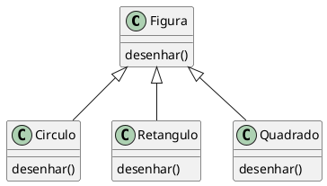
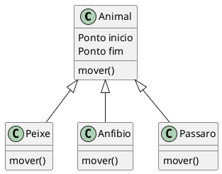
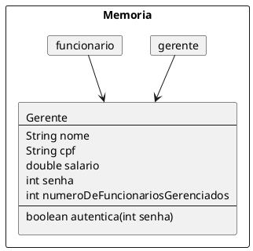

# Polimorfismo

- É a possibilidade de se solicitar um serviço a um objeto, cuja execução vai depender do tipo de objeto instanciado

<figure>



<figcaption>UML da relação entre Figura, Circulo, Retangulo e Quadrado.</figcaption>
</figure>

- `Círculo`, `Retangulo` e `Quadrado` são do tipo `Figura`. 
    - Método desenhar()
- O resultado depende do tipo de figura que receber a mensagem

- O polimorfismo permite escrever programas que processam objetos que compartilham a mesma superclasse em uma hierarquia de classe como se todas fossem objetos da superclasse.

- Sistema de simulação de movimento de Animais

<figure>



<figcaption>UML da relação entre Animal, Peixe, Anfíbio e Pássaro.</figcaption>
</figure>

- Peixes, Anfíbios, Pássaros
    - Superclasse Animal
        - Método mover
        - Localização x,y
    - Todas as subclasses implementam o método mover
- O programa envia a mensagem "mover" para os 3 objetos

<code-group>
<code-block title="Foreach">

```java
List<Animal> animais = List.of(new Peixe(), new Anfibio(), new Passaro());
for(Animal animal : animais ) {
    animal.mover();//como será o movimento desse animal?
}
```
</code-block>

<code-block title="for">

```java
//...
Animal animal[] = new Animal[3];
//...
for(int i = 0; i < 3 ; i++){
    animal[i].mover();//como será o movimento desse animal?
}
//...
```

</code-block>
</code-group>


- Cada animal responde ao método mover de uma maneira diferente
    - O peixe pode nadar 2 metros
    - Anfíbio pular 1 metro
    - Pássaro voar 3 metros
- Cada objeto irá responder a mensagem "mover" de acordo com sua instancia
- Apesar de todos serem Animais o fato do método "mover" ter "muitas formas" é a chave do polimorfismo 
    - Polimorfismo vem de Polimorfo, "Que é sujeito a mudar de forma"


::: tip Definição
Polimorfismo possibilita tratar objetos de tipos mais especializados de forma genérica
:::

## Caelum 

[^caelumoo]

O que guarda uma variável do tipo `Funcionario`? Uma referência para um `Funcionario`, nunca o objeto em
si.

Na herança, vimos que todo `Gerente` **é um** `Funcionario`, pois é uma extensão deste. Podemos nos referir a um `Gerente` como sendo um `Funcionario`. Se alguém precisa falar com um `Funcionario` do banco, pode falar com um `Gerente`! Porque? Pois `Gerente` **é um** `Funcionario`. Essa é a semântica da herança.

```java
Gerente gerente = new Gerente();
Funcionario funcionario = gerente;
funcionario.setSalario(5000.0);
```

<figure>




<figcaption>Representação da memória de duas variáveis para a mesmo referência.</figcaption>
</figure>


Polimorfismo é a capacidade de um objeto poder ser referenciado de várias formas. (cuidado, polimorfismo não quer dizer que o objeto fica se transformando, muito pelo contrário, um objeto nasce de um tipo e morre daquele tipo, o que pode mudar é a maneira como nos referimos a ele).

Até aqui tudo bem, mas e se eu tentar:

```java
funcionario.getBonificacao();
```

Qual é o retorno desse método? `500` ou `750`? No Java, a invocação de método sempre vai ser **decidida em tempo de execução**. O Java vai procurar o objeto na memória e, aí sim, decidir qual método deve ser chamado, sempre relacionando com sua classe de verdade, e não com a que estamos usando para referenciá-lo. Apesar de estarmos nos referenciando a esse `Gerente` como sendo um `Funcionario`, o método executado é o do `Gerente`. O retorno é `750`.

Parece estranho criar um gerente e referenciá-lo como apenas um funcionário. Por que faríamos isso? Na verdade, a situação que costuma aparecer é a que temos um método que recebe um argumento do tipo `Funcionario`:
```java
class ControleDeBonificacoes {
    private double totalDeBonificacoes = 0;
    public void registra(Funcionario funcionario) {
        this.totalDeBonificacoes += funcionario.getBonificacao();
    }
    public double getTotalDeBonificacoes() {
        return this.totalDeBonificacoes;
    }
}
```

E, em algum lugar da minha aplicação (ou no main, se for apenas para testes):
```java
ControleDeBonificacoes controle = new ControleDeBonificacoes();

Gerente funcionario1 = new Gerente();

funcionario1.setSalario(5000.0);
controle.registra(funcionario1);
Funcionario funcionario2 = new Funcionario();
funcionario2.setSalario(1000.0);
controle.registra(funcionario2);
System.out.println(controle.getTotalDeBonificacoes());
```


Perceba que conseguimos passar um `Gerente` para um método que recebe um `Funcionario` como argumento. Pense como numa porta na agência bancária com o seguinte aviso: "Permitida a entrada apenas de Funcionários". Um gerente pode passar nessa porta? Sim, pois `Gerente` **é um** `Funcionario`.

Qual será o valor resultante? Não importa que dentro do método registra do  `ControleDeBonificacoes` receba `Funcionario`. Quando ele receber um objeto que realmente é um `Gerente`, o seu método reescrito será invocado. Reafirmando: não importa como nos referenciamos a um objeto, o método que será invocado é sempre o que é dele.

No dia em que criarmos uma classe `Secretaria`, por exemplo, que é filha de `Funcionario`, precisaremos mudar a classe de `ControleDeBonificacoes`? Não. Basta a classe `Secretaria` reescrever os métodos que lhe parecerem necessários. É exatamente esse o poder do polimorfismo, juntamente com a reescrita de método: diminuir o acoplamento entre as classes, para evitar que novos códigos resultem em modificações em inúmeros lugares.

Perceba que quem criou `ControleDeBonificacoes` pode nunca ter imaginado a criação da classe `Secretaria` ou `Engenheiro`. Contudo, não será necessário reimplementar esse controle em cada nova classe: reaproveitamos aquele código


::: warning Herança versus acoplamento
Note que o uso de herança aumenta o acoplamento entre as classes, isto é, o quanto uma classe depende de outra. A relação entre classe mãe e filha é muito forte e isso acaba fazendo com que o programador das classes filhas tenha que conhecer a implementação da classe pai e vice-versa. Fica difícil fazer uma mudança pontual no sistema.

Por exemplo, imagine se tivermos que mudar algo na nossa classe Funcionario, mas não quiséssemos que todos os funcionários sofressem a mesma mudança. Precisaríamos passar por cada uma das filhas de Funcionario verificando se ela se comporta como deveria ou se devemos sobrescrever o tal método modificado.

Esse é um problema da herança, e não do polimorfismo, que resolveremos mais tarde com a
ajuda de Interfaces.
:::


### Um outro exemplo

Imagine que vamos modelar um sistema para a faculdade que controle as despesas com funcionários e professores. Nosso funcionário fica assim:
```java
class EmpregadoDaFaculdade {
    private String nome;
    private double salario;
    double getGastos() {
        return this.salario;
    }
    String getInfo() {
        return "nome: " + this.nome + " com salário " + this.salario;
    }
    // métodos de get, set e outros
}
```

O gasto que temos com o professor não é apenas seu salário. Temos de somar um bônus de 10 reais por hora/aula. O que fazemos então? Reescrevemos o método. Assim como o `getGastos` é diferente, o `getInfo` também será, pois temos de mostrar as horas/aula também.
```java
class ProfessorDaFaculdade extends EmpregadoDaFaculdade {
    private int horasDeAula;
    double getGastos() {
        return this.getSalario() + this.horasDeAula * 10;
    }
    String getInfo() {
        String informacaoBasica = super.getInfo();
        String informacao = informacaoBasica + " horas de aula: " + this.horasDeAula;
        return informacao;
    }
    // métodos de get, set e outros que forem necessários
}
```

A novidade, aqui, é a palavra chave super. Apesar do método ter sido reescrito, gostaríamos de acessar o método da classe mãe, para não ter de copiar e colocar o conteúdo desse método e depois concatenar com a informação das horas de aula.

Como tiramos proveito do polimorfismo? Imagine que temos uma classe de relatório:
```java
class GeradorDeRelatorio {
    public void adiciona(EmpregadoDaFaculdade f) {
        System.out.println(f.getInfo());
        System.out.println(f.getGastos());
    }
}
```

Podemos passar para nossa classe qualquer `EmpregadoDaFaculdade`! Vai funcionar tanto para professor, quanto para outros funcionários.

Um certo dia, muito depois de terminar essa classe de relatório, resolvemos aumentar nosso sistema, e colocar uma classe nova, que representa o `Reitor`. Como ele também é um `EmpregadoDaFaculdade`, será que vamos precisar alterar algo na nossa classe de `Relatorio`? Não. Essa é a ideia! Quem programou a classe `GeradorDeRelatorio` nunca imaginou que existiria uma classe `Reitor` e, mesmo assim, o sistema funciona.

```java
class Reitor extends EmpregadoDaFaculdade {
    // informações extras
    String getInfo() {
        return super.getInfo() + " e ele é um reitor";
    }
    // não sobrescrevemos o getGastos!!!
}
```

## K19

[^k19oo]

### Controle de Ponto

O sistema do banco deve possuir um controle de ponto para registrar a entrada e saída dos funcionários. O pagamento dos funcionários depende dessas informações. Podemos definir uma classe para implementar o funcionamento de um relógio de ponto.
```java
class ControleDePonto {
    public void registraEntrada(Gerente g) {
        SimpleDateFormat sdf = new SimpleDateFormat("dd/MM/ yyyy HH:mm:ss") ;
        Date agora = new Date();
        System.out.println("ENTRADA:"+g.getCodigo());
        System.out.println("DATA:"+sdf.format(agora));
    }
    public void registraSaida(Gerente g) {
        SimpleDateFormat sdf = new SimpleDateFormat("dd/MM/ yyyy HH:mm:ss") ;
        Date agora = new Date() ;
        System.out.println("SAÍDA:"+g.getCodigo());
        System.out.println("DATA:"+sdf.format(agora));
    }
}
```
A classe acima possui dois métodos: o primeiro para registrar a entrada e o segundo para registrar a saída dos gerentes do banco. Contudo, esses dois métodos não são aplicáveis aos outros tipos de funcionários.

Seguindo essa abordagem, a classe `ControleDePonto` precisaria de um par de métodos para cada cargo. Então, a quantidade de métodos dessa classe seria igual a quantidade de cargos multiplicada por dois. Imagine que no banco exista 30 cargos distintos. Teríamos 60 métodos na classe `ControleDePonto`.

Os procedimentos de registro de entrada e saída são idênticos para todos os funcionários. Consequentemente, qualquer alteração na lógica desses procedimentos implicaria na modificação de todos os métodos da classe `ControleDePonto`.

Além disso, se o banco definir um novo tipo de funcionário, dois novos métodos praticamente
idênticos aos que já existem teriam de ser adicionados na classe `ControleDePonto`. Analogamente, se um cargo deixar de existir, os dois métodos correspondentes da classe `ControleDePonto` deverão ser retirados.

### Modelagem dos funcionários

Com o intuito inicial de reutilizar código, podemos modelar os diversos tipos de funcionários do banco utilizando o conceito de herança.

```java
class Funcionario {
    private int codigo ;
    // GETTERS AND SETTERS
}
```
```java
class Gerente extends Funcionario {
    private String usuario ;
    private String senha ;
    // GETTERS AND SETTERS
}
```
```java
class Telefonista extends Funcionario {
    private int ramal ;
    // GETTERS AND SETTERS
}
```

#### É UM (extends)

Além de gerar reaproveitamento de código, a utilização de herança permite que objetos criados a partir das classes específicas sejam tratados como objetos da classe genérica.

Em outras palavras, a herança entre as classes que modelam os funcionários permite que objetos criados a partir das classes `Gerente` ou `Telefonista` sejam tratados como objetos da classe `Funcionario`.

No código da classe `Gerente` utilizamos a palavra **extends**. Ela pode ser interpretada como a
expressão: **É UM** ou **É UMA**.

```java
class Gerente extends Funcionario
// TODO Gerente É UM Funcionario
```

Como está explícito no código que todo gerente é um funcionário então podemos criar um objeto da classe `Gerente` e tratá-lo como um objeto da classe `Funcionario` também.
```java
// Criando um objeto da classe Gerente
Gerente g = new Gerente();
// Tratando um gerente como um objeto da classe Funcionario
Funcionario f = g ;
```

Em alguns lugares do sistema do banco será mais vantajoso tratar um objeto da classe `Gerente` como um objeto da classe `Funcionario`. 

#### Melhorando o controle de ponto

O registro da entrada ou saída não depende do cargo do funcionário. Não faz sentido criar um  método que registre a entrada para cada tipo de funcionário, pois eles serão sempre idênticos. Analogamente, não faz sentido criar um método que registre a saída para cada tipo de funcionário.

Dado que podemos tratar os objetos das classes derivadas de `Funcionario` como sendo objetos dessa classe, podemos implementar um método que seja capaz de registrar a entrada de qualquer funcionário independentemente do cargo. Analogamente, podemos fazer o mesmo para o procedimento de saída.
```java
class ControleDePonto {
    public void registraEntrada(Funcionario f) {
    SimpleDateFormat sdf = new SimpleDateFormat("dd/MM/ yyyy HH:mm:ss") ;
    Date agora = new Date() ;
        System.out.println("ENTRADA:"+f.getCodigo());
        System.out.println("DATA:"+sdf.format(agora));
    }
    public void registraSaida(Funcionario f) {
        SimpleDateFormat sdf = new SimpleDateFormat("dd/MM/ yyyy HH:mm:ss") ;
        Date agora = new Date() ;
        System.out.println("SAÍDA:"+f.getCodigo());
        System.out.println("DATA:"+sdf.format(agora));
    }
}
```

Os métodos `registraEntrada()` e `registraSaida()` recebem referências de objetos da classe `Funcionario` como parâmetro. Consequentemente, podem receber referências de objetos de qualquer classe que deriva direta ou indiretamente da classe Funcionario.

A capacidade de tratar objetos criados a partir das classes específicas como objetos de uma classe genérica é chamada de polimorfismo.

Aplicando a ideia do polimorfismo no controle de ponto, facilitamos a manutenção da classe `ControleDePonto`. Qualquer alteração no procedimento de entrada ou saída implica em alterações em métodos únicos.

Além disso, novos tipos de funcionários podem ser definidos sem a necessidade de qualquer alteração na classe `ControleDePonto`. Analogamente, se algum cargo deixar de existir, nada precisará ser modificado na classe `ControleDePonto`.


## Referências

<!-- @include: ../bib/bib.md -->
