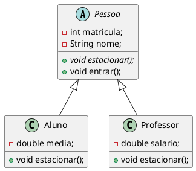
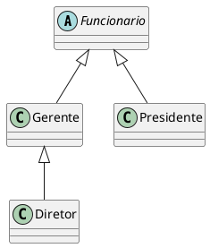
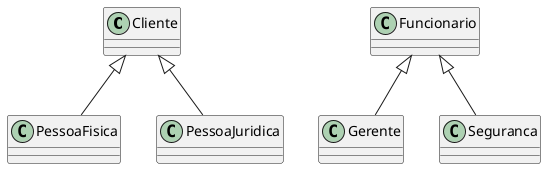
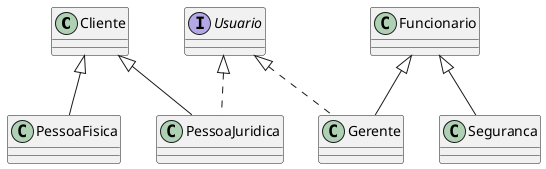
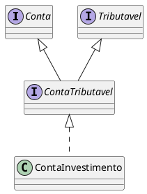

# Classes Abstratas


- Classes abstratas são classes que não produzem instâncias. Elas agrupam características e comportamentos que serão herdados por outras classes
- Fornecem padrões de comportamento que serão implementados nas suas subclasses
- Podem ter métodos com implementação definida
- Não pode ser instanciada diretamente (`new`).
- Uma classe abstrata possui características que devem ser implementadas por classes filhas
- Os métodos abstratos são obrigatoriamente implementados pelas classes filhas concretas, quando a mesma herda de uma classe abstrata. 

```java
public abstract class Pessoa { 
    int matricula; 
    String nome; 
    public abstract void estacionar(); 
    public void entrar(){ 
        System.out.println("Entrando na Faculdade"); 
    } 
}
```

```java
public class Aluno extends Pessoa { 
    double media; 

    public void estacionar(){ 
        System.out.println("Estacionando na área para estudante..."); 
    } 
} 
```

```java
public class Professor extends Pessoa { 
    double salario;
    public void estacionar(){ 
        System.out.println("Estacionando nas vagas de professor"); 
    } 
}
```

<figure>



<figcaption>UML Classe abstrata Pessoa e classes concretas Aluno e Professor.</figcaption>
</figure>

## Outros Exemplos

### Caelum 

[^caelumoo]

Vamos recordar em como pode estar nossa classe `Funcionario`:

```java
class Funcionario {
    protected String nome;
    protected String cpf;
    protected double salario;
    public double getBonificacao() {
        return this.salario * 1.2;
    }
    // outros métodos aqui
}
```

Considere o nosso `ControleDeBonificacao`:

```java
class ControleDeBonificacoes {
    private double totalDeBonificacoes = 0;
    public void registra(Funcionario f) {
        System.out.println("Adicionando bonificação do funcionario: " + f);
        this.totalDeBonificacoes += f.getBonificacao();
    }
    public double getTotalDeBonificacoes() {
        return this.totalDeBonificacoes;
    }
}
```

Nosso método `registra` recebe qualquer referência do tipo `Funcionario`, isto é, podem ser objetos do tipo `Funcionario` e qualquer de seus subtipos: `Gerente`, `Diretor` e, eventualmente, alguma nova subclasse que venha ser escrita, sem prévio conhecimento do autor da `ControleDeBonificacao`.

Estamos utilizando aqui a classe `Funcionario` para o polimorfismo. Se não fosse ela, teríamos um grande prejuízo: precisaríamos criar um método `registra` para receber cada um dos tipos de `Funcionario`, um para `Gerente`, um para `Diretor`, etc. Repare que perder esse poder é muito pior do que a pequena vantagem que a herança traz em herdar código.

Porém, em alguns sistemas, como é o nosso caso, usamos uma classe com apenas esses intuitos: de economizar um pouco código e ganhar polimorsmo para criar métodos mais genéricos, que se encaixem a diversos objetos.

Faz sentido ter uma referência do tipo `Funcionario`? Essa pergunta é diferente de saber se faz sentido ter um objeto do tipo `Funcionario:` nesse caso, faz sim e é muito útil.

Referenciando `Funcionario` temos o polimorfismo de referência, já que podemos receber qualquer objeto que seja um `Funcionario`. Porém, dar `new` em `Funcionario` pode não fazer sentido, isto é, não queremos receber um objeto do tipo `Funcionario`, mas sim que aquela referência seja ou um `Gerente`, ou um `Diretor`, etc. Algo mais **concreto** que um `Funcionario`.

```java
ControleDeBonificacoes cdb = new ControleDeBonificacoes();
Funcionario f = new Funcionario();
cdb.adiciona(f); // faz sentido?
```

Vejamos um outro caso em que não faz sentido ter um objeto daquele tipo, apesar da classe existir: imagine a classe `Pessoa` e duas filhas, `PessoaFisica` e `PessoaJuridica`. Quando puxamos um relatório de nossos clientes (uma `array` de `Pessoa` por exemplo), queremos que cada um deles seja ou uma `PessoaFisica`, ou uma `PessoaJuridica`. A classe `Pessoa`, nesse caso, estaria sendo usada apenas para ganhar o polimorfismo e herdar algumas coisas: não faz sentido permitir instanciá-la.

Para resolver esses problemas, temos as *classes abstratas*.


#### Classe abstrata

O que, exatamente, vem a ser a nossa classe `Funcionario`? Nossa empresa tem apenas Diretores, Gerentes, Secretárias, etc. Ela é uma classe que apenas idealiza um tipo, define apenas um rascunho.

Para o nosso sistema, é inadmissível que um objeto seja apenas do tipo `Funcionario` (pode existir um sistema em que faça sentido ter objetos do tipo Funcionario ou apenas `Pessoa`, mas, no nosso caso, não).

Usamos a palavra chave *abstract* para impedir que ela possa ser instanciada. Esse é o efeito direto de se usar o modificador `abstract` na declaração de uma classe:

```java
abstract class Funcionario {
    protected double salario;
    public double getBonificacao() {
        return this.salario * 1.2;
    }
    // outros atributos e métodos comuns a todos Funcionarios
}
```

E, no meio de um código:

```java
Funcionario f = new Funcionario(); // não compila!!!
```

O código acima não compila. O problema é instanciar a classe - criar referência, você pode. Se ela não pode ser instanciada, para que serve? Serve para o polimorfismo e herança dos atributos e métodos, que são recursos muito poderosos, como já vimos.

Vamos então herdar dessa classe, reescrevendo o método `getBonificacao`

```java
class Gerente extends Funcionario {
    public double getBonificacao() {
        return this.salario * 1.4 + 1000;
    }
}
```

<figure>



<figcaption>UML da classe abstrata Funcionario e das classes concretas Gerente, Presidente e Diretor.</figcaption>

</figure>

Mas qual é a real vantagem de uma classe abstrata? Poderíamos ter feito isto com uma herança comum. Por enquanto, a única diferença é que não podemos instanciar um objeto do tipo `Funcionario`, que já é de grande valia, dando mais consistência ao sistema.

Fique claro que a nossa decisão de transformar `Funcionario` em uma classe abstrata dependeu do nosso domínio. Pode ser que, em um sistema com classes similares, faça sentido que uma classe análoga a `Funcionario` seja concreta.

#### Métodos abstratos
Se o método `getBonificacao` não fosse reescrito, ele seria herdado da classe mãe, fazendo com que devolvesse o salário mais 20%.

Levando em consideração que cada funcionário em nosso sistema tem uma regra totalmente diferente para
ser bonificado, faz algum sentido ter esse método na classe `Funcionario`? Será que existe uma bonificação
padrão para todo tipo de `Funcionario`? Parece que não, cada classe filha terá um método diferente de bonificação pois, de acordo com nosso sistema, não existe uma regra geral: queremos que cada pessoa que escreve
a classe de um `Funcionario` diferente (subclasses de `Funcionario`) reescreva o método `getBonificacao` de
acordo com as suas regras.

Poderíamos, então, jogar fora esse método da classe `Funcionario`? O problema é que, se ele não existisse,
não poderíamos chamar o método apenas com uma referência a um `Funcionario`, pois ninguém garante
que essa referência aponta para um objeto que possui esse método. Será que então devemos retornar um
código, como um número negativo? Isso não resolve o problema: se esquecermos de reescrever esse método,
teremos dados errados sendo utilizados como bônus.

Existe um recurso em Java que, em uma classe abstrata, podemos escrever que determinado método será
sempre escrito pelas classes filhas. Isto é, um **método abstrato**.

Ele indica que todas as classes filhas (concretas, isto é, que não forem abstratas) devem reescrever esse método
ou não compilarão. É como se você herdasse a responsabilidade de ter aquele método.

::: tip Como declarar um método abstrato
Às vezes, não fica claro como declarar um método abstrato.

Basta escrever a palavra chave *abstract* na assinatura do mesmo e colocar um ponto e vírgula
em vez de abre e fecha chaves!
:::

```java
abstract class Funcionario {
    abstract double getBonificacao();
    // outros atributos e métodos
}
```


### K19

[^k19oo]


#### Classes Abstratas

No banco, todas as contas são de um tipo específico. Por exemplo, conta poupança, conta corrente ou conta salário. Essas contas poderiam ser modeladas através das seguintes classes utilizando o conceito de herança:

```java
class Conta {
    // Atributos
    // Construtores
    // Métodos
}
```

```java
class ContaPoupanca extends Conta {
    // Atributos
    // Construtores
    // Métodos
}
```

```java
class ContaCorrente extends Conta {
    // Atributos
    // Construtores
    // Métodos
}
```

Para cada conta do domínio do banco devemos criar um objeto da classe correspondente ao tipo da conta. Por exemplo, se existe uma conta poupança no domínio do banco devemos criar um objeto da classe `ContaPoupanca`.

```java
ContaPoupanca cp = new ContaPoupanca();
```

Faz sentido criar objetos da classe `ContaPoupanca` pois existem contas poupança no domínio do banco. Dizemos que a classe `ContaPoupanca` é uma classe concreta pois criaremos objetos a partir dela.

Por outro lado, a classe `Conta` não define uma conta que de fato existe no domínio do banco. Ela apenas serve como "base" para definir as contas concretos.

Não faz sentido criar um objeto da classe `Conta` pois estaríamos instanciado um objeto que não é suficiente para representar uma conta que pertença ao domínio do banco. Mas, a princípio, não há nada proibindo a criação de objetos dessa classe. Para adicionar essa restrição no sistema, devemos tornar a classe `Conta` **abstrata**.

Uma classe concreta pode ser diretamente utilizada para instanciar objetos. Por outro lado, uma classe abstrata não pode. Para definir uma classe abstrata, basta adicionar o modificador abstract.

```java
abstract class Conta {
    // Atributos
    // Construtores
    // Métodos
}
```

Todo código que tenta criar um objeto de uma classe abstrata não compila.

```java
// Erro de compilação
Conta c = new Conta();
```

#### Métodos Abstratos
Suponha que o banco ofereça extrato detalhado das contas e para cada tipo de conta as informações e o formato desse extrato detalhado são diferentes. Além disso, a qualquer momento o banco pode mudar os dados e o formato do extrato detalhado de um dos tipos de conta.

Neste caso, parece não fazer sentido ter um método na classe `Conta` para gerar extratos detalhados pois ele seria reescrito nas classes específicas sem nem ser reaproveitado.

Poderíamos, simplesmente, não definir nenhum método para gerar extratos detalhados na classe `Conta`. Porém, não haveria nenhuma garantia que as classes que derivam direta ou indiretamente da classe `Conta` implementem métodos para gerar extratos detalhados.

Mas, mesmo supondo que toda classe derivada implemente um método para gerar os extratos que desejamos, ainda não haveria nenhuma garantia em relação as assinaturas desses métodos. As classes derivadas poderiam definir métodos com nomes ou parâmetros diferentes. Isso prejudicaria a utilização dos objetos que representam as contas devido a falta de padronização das operações.

Para garantir que toda classe concreta que deriva direta ou indiretamente da classe `Conta` tenha uma implementação de método para gerar extratos detalhados e além disso que uma mesma assinatura de método seja utilizada, devemos utilizar o conceito de métodos abstratos.

Na classe `Conta`, definimos um método abstrato para gerar extratos detalhados. Um método abstrato não possui corpo (implementação).

```java
abstract class Conta {
    // Atributos
    // Construtores
    // Métodos
    public abstract void imprimeExtratoDetalhado();
}
```

As classes concretas que derivam direta ou indiretamente da classe Conta devem possuir uma implementação para o método `imprimeExtratoDetalhado()`.

```java
class ContaPoupanca extends Conta {
    private int diaDoAniversario ;
    public void imprimeExtratoDetalhado(){
        System.out.println("EXTRATO DETALHADO DE CONTA POUPANÇA") ;
        SimpleDateFormat sdf = new SimpleDateFormat ("dd/MM/yyyy HH:mm:ss") ;
        Date agora = new Date();
        System.out.println("DATA:"+sdf.format(agora));
        System.out.println("SALDO:"+this.getSaldo());
        System.out.println("ANIVERSÁRIO:"+this.diaDoAniversario);
    }
}
```

Se uma classe concreta derivada da classe `Conta` não possuir uma implementação do método `imprimeExtratoDetalhado()` ela não compilará.

```java
// ESSA CLASSE NÃO COMPILA
class ContaPoupanca extends Conta {
}
```

## Interface

#### Padronização

No dia a dia, estamos acostumados a utilizar aparelhos que dependem de energia elétrica. Esses aparelhos possuem um plugue que deve ser conectado a uma tomada para obter a energia necessária.

Diversas empresas fabricam aparelhos elétricos com plugues. Analogamente, diversas empresas fabricam tomadas elétricas. Suponha que cada empresa decida por conta própria o formato dos plugues ou das tomadas que fabricará. Teríamos uma infinidade de tipos de plugues e tomadas que tornaria a utilização dos aparelhos elétricos uma experiência extremamente desagradável.

Inclusive, essa falta de padrão pode gerar problemas de segurança aos usuários. Os formatos dos plugues ou das tomadas pode aumentar o risco de uma pessoa tomar um choque elétrico.

Com o intuito de facilitar a utilização dos consumidores e aumentar a segurança dos mesmos, o governo através dos órgãos responsáveis estabelece padrões para os plugues e tomadas. Esses padrões estabelecem restrições que devem ser respeitadas pelos fabricantes dos aparelhos e das tomadas.

Em diversos contextos, padronizar pode trazer grandes benefícios. Inclusive, no desenvolvimento de aplicações. Mostraremos como a ideia de padronização pode ser contextualizada nos conceitos de orientação a objetos.

#### Contratos
Num sistema orientado a objetos, os objetos interagem entre si através de chamadas de métodos (troca de mensagens). Podemos dizer que os objetos se “encaixam” através dos métodos públicos assim como um plugue se encaixa em uma tomada através dos pinos.

Para os objetos de uma aplicação “conversarem” entre si mais facilmente é importante padronizar o conjunto de métodos oferecidos por eles. Assim como os plugues encaixam nas tomadas mais facilmente graças aos padrões definidos pelo governo.

Um padrão é definido através de especificações ou contratos. Nas aplicações orientadas a objetos, podemos criar um “contrato” para definir um determinado conjunto de métodos que deve ser implementado pelas classes que “assinarem” este contrato. Em orientação a objetos, um contrato é chamado de interface. Um interface é composta basicamente por métodos abstratos.


#### Exemplo
No sistema do banco, podemos definir uma interface (contrato) para padronizar as assinaturas dos métodos oferecidos pelos objetos que representam as contas do banco.

```java
interface Conta {
    void deposita ( double valor ) ;
    void saca ( double valor ) ;
}
```

Os métodos de uma interface não possuem corpo (implementação) pois serão implementados nas classes vinculadas a essa interface. Todos os métodos de uma interface devem ser públicos e abstratos. Os modificadores public e **abstract** são opcionais.

As classes que definem os diversos tipos de contas que existem no banco devem implementar (assinar) a interface Conta.

```java
class ContaPoupanca implements Conta {
    public void deposita ( double valor ) {
    // implementacao
    }
    public void saca ( double valor ) {
    // implementacao
    }
}
```

```java
class ContaCorrente implements Conta {
    public void deposita ( double valor ) {
    // implementacao
    }
    public void saca ( double valor ) {
    // implementacao
    }
}
```

As classes concretas que implementam uma interface são obrigadas a possuir uma implementação para cada método declarado na interface. Caso contrário, ocorrerá um erro de compilação.

```java
// Esta classe não compila porque ela não implementou o método saca ()
class ContaCorrente implements Conta {
    public void deposita ( double valor ) {
    // implementacao
    }
}
```

A primeira vantagem de utilizar uma interface é a padronização das assinaturas dos métodos oferecidos por um determinado conjunto de classes. A segunda vantagem é garantir que determinadas classes implementem certos métodos.

#### Polimorfismo

Se uma classe implementa uma interface, podemos aplicar a ideia do polimorfismo assim como quando aplicamos herança. Dessa forma, outra vantagem da utilização de interfaces é o ganho do polimorfismo.

Como exemplo, suponha que a classe ContaCorrente implemente a interface Conta. Podemos guardar a referência de um objeto do tipo ContaCorrente em uma variável do tipo Conta.

```java
Conta c = new ContaCorrente();
```

Além disso, podemos passar uma variável do tipo ContaCorrente para um método que o parâmetro seja do tipo Conta.

```java
class GeradorDeExtrato {
    public void geraExtrato ( Conta c ) {
    // implementação
    }
}
```

```java
GeradorDeExtrato g = new GeradorDeExtrato();
ContaCorrente c = new ContaCorrente();
g.geraExtrato(c) ;
```

O método `geraExtrato()` pode ser utilizado para objetos criados a partir de classes que implementam direta ou indiretamente a interface Conta.


#### Interface e Herança

As vantagens e desvantagens entre interface e herança, provavelmente, é um dos temas mais discutido nos blogs, fóruns e revistas que abordam desenvolvimento de software orientado a objetos.

Muitas vezes, os debates sobre este assunto se estendem mais do que a própria importância desse tópico. Muitas pessoas se posicionam de forma radical defendendo a utilização de interfaces ao invés de herança em qualquer situação.

Normalmente, esses debates são direcionados na análise do que é melhor para manutenção das aplicações: utilizar interfaces ou aplicar herança.

A grosso modo, priorizar a utilização de interfaces permite que alterações pontuais em determinados trechos do código fonte sejam feitas mais facilmente pois diminui as ocorrências de efeitos colaterais indesejados no resto da aplicação. Por outro lado, priorizar a utilização de herança pode diminuir a quantidade de código escrito no início do desenvolvimento de um projeto.

Algumas pessoas propõem a utilização de interfaces juntamente com composição para substituir totalmente o uso de herança. De fato, esta é uma alternativa interessante pois possibilita que um trecho do código fonte de uma aplicação possa ser alterado sem causar efeito colateral no restante do sistema além de permitir a reutilização de código mais facilmente.

Em Java, como não há herança múltipla, muitas vezes, interfaces são apresentadas como uma alternativa para obter um grau maior de polimorfismo.

Por exemplo, suponha duas árvores de herança independentes


<figure>



<figcaption>Duas árvores de herança independentes.</figcaption>
</figure>

Suponha que os gerentes e as empresas possam acessar o sistema do banco com um nome de usuário e uma senha. Seria interessante utilizar um único método para implementar a autenticação desses dois tipos de objetos. Mas, qual seria o tipo de parâmetro deste método? Lembrando que ele deve aceitar gerentes e empresas.

```java
class AutenticadorDeUsuario {
    public boolean autentica (??? u ) {
    // implementação
    }
}
```

De acordo com as árvores de herança, não há polimorfismo entre objetos da classe Gerente e da classe Empresa. Para obter polimorfismo entre os objetos dessas duas classes somente com herança, deveríamos colocá-las na mesma árvore de herança. Mas, isso não faz sentido pois uma empresa não é um funcionário e o gerente não é cliente. Neste caso, a solução é utilizar interfaces para obter o polimorfismo desejado


<figure>



<figcaption>Obtendo mais polimorfismo.</figcaption>
</figure>


Agora, conseguimos definir o que o método autentica() deve receber como parâmetro para trabalhar tanto com gerentes quanto com empresas. Ele deve receber um parâmetro do tipo Usuario.


@[code](./code/Usuario.java)
@[code](./code/Cliente.java)
@[code](./code/PessoaFisica.java)
@[code](./code/PessoaJuridica.java)
@[code](./code/Funcionario.java)
@[code](./code/Gerente.java)
@[code](./code/Seguranca.java)
@[code](./code/AutenticadorDeUsuario.java)


##### Mais sobre herança e interface

```java
public interface Conta {
    public double getSaldo();
    public void deposita(double valor);
    public void saca(double valor);
    public void atualiza(double taxaSelic);
}

class ContaCorrente implements Conta {
// ...
}
class ContaPoupanca implements Conta {
// ...
}
``` 

Às vezes, é interessante criarmos uma interface que herda de outras interfaces: essas, são chamadas subinterfaces. Essas, nada mais são do que um agrupamento de obrigações para a classe que a implementar

```java
interface  Tributavel {
    //...
    public void calcularTributo();
}
```

```java
interface ContaTributavel extends Conta, Tributavel {

}
```
Dessa maneira, quem for implementar essa nova interface precisa implementar todos os métodos herdados das suas superinterfaces (e talvez ainda novos métodos declarados dentro dela):

```java
class ContaInvestimento implements ContaTributavel {
// métodos
}

``` 

```java
ContaTributavel ct = new ContaInvestimento();
Conta c = new ContaInvestimento();
Tributavel t = new ContaInvestimento();
```

Perceba que o código pode parecer estranho, pois a interface não declara método algum, só herda os
métodos abstratos declarados nas outras interfaces. Ao mesmo tempo que uma interface pode herdar de mais de uma outra interface, classes só podem possuir uma classe mãe (herança simples).

<figure>



<figcaption>Representação da herança entre interfaces.</figcaption>
</figure>

### Interfaces = Classe Abstratas 

Em algumas linguagens de programação não existe o conceito de `interface`. 

A `interface` é um tipo específico de classe abstrata onde existe apenas as definições de comportamentos.

## Referências

<!-- @include: ../bib/bib.md -->
