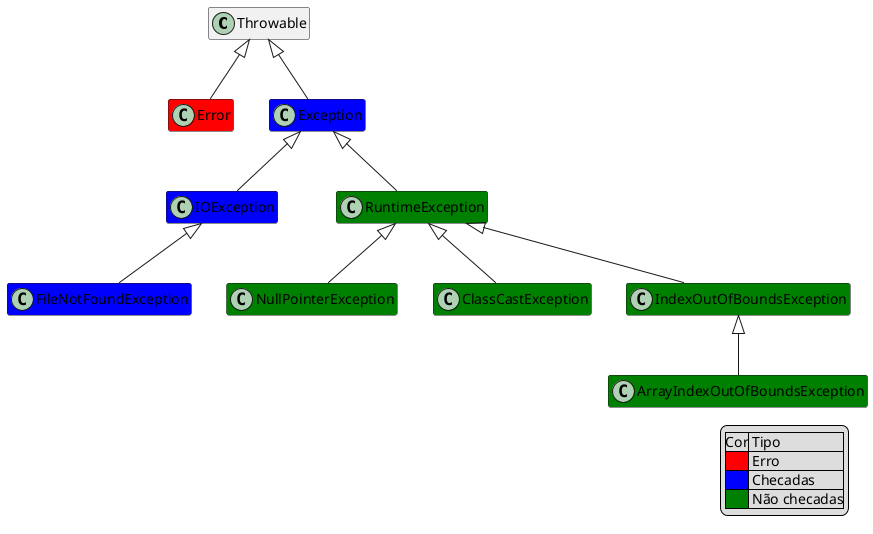

# Exceptions

Considerando o que foi visto em [Pilha de execução](/posts/02_Codificando_JAVA.html#pilha-de-execucao).

Quando um erro (exceção) ocorre, o JVM entra em estado de alerta e procura dento do metodo se existe algum tratamento especial para o problema.

@[code](./code/TesteErro.java)

```shell
Exception in thread "main" java.lang.ArrayIndexOutOfBoundsException: Index 10 out of bounds for length 10
        at TesteErro.metodo2(TesteErro.java:16)
        at TesteErro.metodo1(TesteErro.java:9)
        at TesteErro.main(TesteErro.java:4)
```

- Como o `metodo2` não tem nenhum tratamento a JVM interrompe sua execução e volta um nível na pilha e verifica novamente.
- Como o `metodo1` também não faz nenhum tratamento a JVM sobe mais um nivel até chegar no `main`
- Como o `main` também não faz nenhum tratamento a Thread morre.


O tratamento de erros em Java é feito em tempo de execução através do tratamento de exceção. As exceções são classes que seguem o modelo OO e são lançadas quando o sistema encontra um problema mas podem ser utilizadas também para validar regras de negócio. 

`Exception`(exceção) significa "condição excepcional", e é uma ocorrência que altera o fluxo normal do programa.

::: tip 
Quando um evento excepcional ocorre em java, diz-se que uma exceção será lançada.
:::

- Métodos podem capturar ou deixar passar exceções que ocorrerem em seu corpo, mas para isto é obrigatório que o método declare a sua decisão. 
- Para repassar o tratamento de erro para quem chama o método utilizamos o `throws`. 
    - `throws` declara que o método pode provocar exceções do tipo declarado (ou de qualquer subtipo).

```java
public void validar() throws Excecao1, Excecao2 {…}
```

Para tratar a exceção no método utilizamos o try/catch.

```java
try {
    for (int i = 0; i <= 15; i++) {
        array[i] = i;
        System.out.println(i);
    }
} catch (ArrayIndexOutOfBoundsException e) {
    System.out.println("erro: " + e);
}
```
Executando o código novamente

```shell
erro: java.lang.ArrayIndexOutOfBoundsException: Index 10 out of bounds for length 10
fim do metodo2
fim do metodo1
fim do main
```

::: tip ?
- Modificando o try para dentro do for qual será o comportamento?
- E na chamada do metodo2?
- E na chamada do metodo1?
- Divisão por 0
- Referência Nula
:::


A partir do momento que uma exception foi catched (pega, tratada, capturada , handled), a execução volta ao normal a partir daquele ponto.

`ArrayIndexOutOfBoundsException` ou um `NullPointerException` poderia ser facilmente evitado com o `for` corretamente escrito ou com `ifs` que checariam os limites da array. Tais problemas provavelmente poderiam ser evitados pelo programador

## Tipos de Exception

- Checadas (Verificadas) –> o compilador verifica e obriga os usuários que chamam o método ou construtor a tratar a exceção
- Não – checadas –> o compilador não verifica, são os subtipos de Error e RuntimeException

<figure>



<figcaption>Família das Exceptions.</figcaption>
</figure>


::: tip 

`RuntimeException` é a exception mãe de todas as exceptions não checadas

:::

Abrir um arquivo para leitura

```java
public class AbrirArquivo {
    public static void metodo() {
        new java.io.FileInputStream("arquivo.txt");
    }
}
```


O código acima não compila e o compilador avisa que é necessário tratar o `FileNotFoundException` que pode ocorrer.Para compilar e fazer o programa funcionar, temos duas maneiras que podemos tratar o problema. A primeira é tratá-lo com o `try` e `catch` e a segunda forma de tratar esse erro, é delegar ele para quem chamou o nosso método, isto é, passar para a frente.

::: code-tabs#java

@tab try

```java
public static void metodo() {
    try {
        new java.io.FileInputStream("arquivo.txt");
    } catch (java.io.FileNotFoundException e) {
        System.out.println("Não foi possível encontrar o  arquivo para leitura");
    }
}
```

@tab throws

```java
public static void metodo() throws java.io.FileNotFoundException {
    new java.io.FileInputStream("arquivo.txt");
}
```

:::

É possível fazer o tratamento de mais de uma exceção no mesmo bloco para ambas abordagens

::: code-tabs#java

@tab try

```java
try{
    //Codigo verificado
}catch(TipoExcecao1 ex1){
    //Captura uma exceção TipoExcecao1
}catch(TipoExcecao2 ex2){
    //Captura uma exceção TipoExcecao2
}
```

@tab throws

```java
public void metodo() throws TipoExcecao1, TipoExcecao2 {
    //…
}
```
:::

Não há uma regra para decidir em que momento do seu programa deve ser feito o tratamento da exceção. Essa decisão depende de como a exceção será tratada e em que ponto é possivel fazer algo a respeito. Enquanto não for o momento, provavelmente será melhor delegar a responsabilidade para o método que invocou. Lembrando que: caso o tratamento não seja feito por nenhum código quem irá tratar é a JVM.

```java
try {
    for(int i = 0; i <= 15; i++) {
        array[i] = i;
        System.out.println(i);
    }
} catch (ArrayIndexOutOfBoundsException e) {
    System.out.println("erro: " + e);
}
```

```java
for(int i = 0; i <= 15; i++) {
    try {
        array[i] = i;
        System.out.println(i);
    } catch (ArrayIndexOutOfBoundsException e) {
        System.out.println("erro: " + e);
    }
}
```

Para lançar a Exceção explicitamente utilizamos o `throw` e criamos uma instancia da classe que representa a exceção desejada

```java
public class MinhaException extends Exception {
    
}

...{
    public double dividir(double v1, double v2) throws MinhaException {
        if(v2==0){
            throw new MinhaException("Divisão por ZERO");
        }
    }
}
```

## Finally

Os blocos `try` e `catch` podem conter uma terceira cláusula chamada `finally` que indica o que deve ser feito após o término do bloco `try` ou de um `catch`.

```java
try {
 // bloco try
} catch (IOException ex) {
 // bloco catch 1
} catch (SQLException sqlex) {
 // bloco catch2
} finally {
 // bloco finally
}
```
É interessante colocar algo que é imprescindível de ser executado, caso o que você queria fazer tenha dado certo, ou não. O caso mais comum é o de liberar um recurso no finally, como um arquivo ou conexão com banco de dados, para que possamos ter a certeza de que aquele arquivo (ou conexão) vá ser fechado, mesmo que algo tenha falhado no decorrer do código.

O bloco `finally` sempre será executado, salvo em raras situações.

De forma geral ele é a garantia de que seu código irá liberar recursos ocupados mesmo que ocorram exceções (Exceptions) ou o método contendo o `try` retorne prematuramente (`return`).

::: tip 

Os únicos momentos em que o `finally` não será chamado são:

1. Se você chamar System.exit() ou
1. um outro thread interromper o atual (através do método interrupt()) ou
1. Se a JVM der crash antes.

:::

- O bloco `try` deve ser precedido por um `catch` ou `finalliy`
- O `finally` quer dizer que dando erro ou não o trecho de código compreendido nele será executado
- O `catch` será executa somente se naquele trecho dentro do try resultar em algum erro


::: tip 

`RuntimeException` é a exception mãe de todas as exceptions não verificadas

:::

::: tip 

`IllegalArgumentException` é uma exceção do pacote do java que podemos utilizar para tratar valores indevidos para chamadas de métodos

:::

## Exercício

[Exercício](./Exercicios/ExercicioException/Exception1.md)


## Links w3schools

- [Exception handling](https://www.w3schools.blog/exception-handling-in-java)
- [try and catch blocks](https://www.w3schools.blog/try-and-catch-blocks-in-java)
- [Multiple catch blocks](https://www.w3schools.blog/multiple-catch-blocks-in-java)
- [Nested try block](https://www.w3schools.blog/nested-try-block-in-java)
- [Finally](https://www.w3schools.blog/finally-in-java)
- [throw](https://www.w3schools.blog/throw-in-java)
- [throws](https://www.w3schools.blog/throws-keyword-in-java)
- [Exception propagation](https://www.w3schools.blog/exception-propagation-in-java)
- [Exception handling with method overriding](https://www.w3schools.blog/exception-handling-with-method-overriding)
- [Custom exception](https://www.w3schools.blog/custom-exception-in-java)
- [Throwable class](https://www.w3schools.blog/commonly-used-exception-methods-of-throwable-class-in-java)
