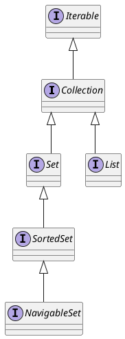
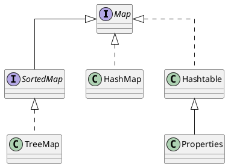
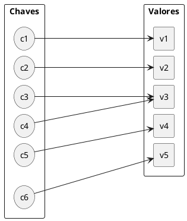

# Collections Framework

## Armazenando dados usando Collections Framework

O Collections Framework é a API mais utilizada do JDK e é provável que você precise armazenar e processar dados na memória em qualquer aplicativo em que esteja trabalhando. A história das estruturas de dados data quase da era da computação e o Collections Framework é uma implementação dos conceitos de como armazenar, organizar e acessar dados na memória que foram desenvolvidos muito antes da criação do Java. Ele faz isso de forma muito eficiente. O Collections Framework foi introduzido pela primeira vez na Java 2 SE em 1998 e foi reescrito duas vezes desde então.

Na versão 5 do Java foram adicionadas várias novas funcionalidades ao Collections Framework. Algumas das principais adições incluem:

- **Generics**: permitem que você especifique o tipo de objeto que pode ser armazenado em uma estrutura de dados, evitando erros de tempo de execução e tornando o código mais legível.
- **Iterators**: permitem percorrer os elementos de uma estrutura de dados de forma segura e flexível, sem expor a implementação interna da estrutura de dados.
- **For-each loop**: uma nova sintaxe de loop que permite percorrer os elementos de uma estrutura de dados de forma mais concisa.

Ja na versão 8 foram adicionadas algumas funcionalidades tais como:

- **Lambda expressions**: permitem que você crie funções anônimas e passá-las como parâmetros para métodos, o que pode tornar o código mais conciso e legível.
- **Streams**: permitem que você processe sequências de dados de forma declarativa e paralela, o que pode melhorar significativamente o desempenho em aplicativos multithread.


Essas duas são as atualizações mais importantes da Collections Framework que foram feitas até agora. Mas, de fato, quase todas as versão do JDK têm seu conjunto de mudanças no Collections Framework.

Você aprenderá nesta parte as estruturas de dados mais úteis que a Collections Framework tem a oferecer, juntamente com os padrões que você usará para manipular esses dados em seu aplicativo.

A primeira coisa que você precisa saber é que, do ponto de vista técnico, a Collections Framework é um conjunto de interfaces que modelam uma maneira diferente de armazenar dados em diferentes tipos de contêineres. Em seguida, a Framework fornece pelo menos uma implementação para cada interface. Conhecer essas implementações é tão importante quanto as interfaces e escolher a correta depende do que você precisa fazer com ela.

### Encontrando o seu caminho no Collections Framework

A quantidade de interfaces e classes na Collections Framework pode ser esmagadora no início. De fato, existem muitas estruturas disponíveis, ambas as classes e interfaces. Alguns têm nomes auto-explicativos, como o `LinkedList`, outros estão carregando comportamento, como o `ConcurrentHashMap`, outros podem parecer estranhos, como o `ConcurrentSkipListMap`.

Você vai usar alguns desses elementos com muito mais frequência do que outros. Se você já está familiarizado com a linguagem java, provavelmente já se deparou com a `List`, a `ArrayList` e o `Map`. Vamos nos concentrar nas estruturas mais usadas da Collections Framework, as que você usará diariamente como desenvolvedor Java e que você precisa conhecer e entender melhor.

Dito isto, você precisa ter o quadro geral do que há para você no Collections Framework.

Primeiro, o framework consiste em interfaces e implementações. Escolher a interface certa significa que você precisa saber quais funções deseja trazer para o seu aplicativo. É o que você precisa consiste em:

- Armazenar objetos e iterar sobre eles?
- Empurrando seu objeto para o fim de uma fila?
- recuperá-los com o uso de uma chave?
- Acessando-os pelo índice?
- Classificá-los?
- Prevendo a presença de duplicatas ou valores nulos?

Escolher a implementação certa significa que você precisa saber como usará essas funcionalidades:

- O acesso aos seus objetos será realizado se forma sequenciada, aleatório ou acesso indexado?
- Os objetos serão definidos no incio do seu aplicativo e não mudarão muito ao longo da vida?
- A quantidade de objetos será importante com muita verificação da presença de certos objetos?
- A estrutura em que você precisa armazenar seus objetos será acessada simultaneamente (concorrência)?

O Collections Framework pode fornecer a solução certa para todos esses problemas.

Existem duas categorias principais de interfaces no Collections Framework: Collections and Maps.

::: tip Dica <i class="fa fa-exclamation-triangle"></i>

Collections são sobre armazenar objetos e iterar sobre eles. A interface `Collection` é a interface raiz desta categoria. De fato, a interface `Collection` estende a interface `Iterable`, mas essa interface não faz parte do Collections Framework.

:::

::: tip Dica <i class="fa fa-exclamation-triangle"></i>

Um `Map` armazena um objeto junto com uma chave, que representa esse objeto, assim como a chave primária representa um objeto em um banco de dados. Às vezes, você ouvirá que os mapas armazenam pares de chave/valor, o que descreve exatamente o que um mapa faz. A interface do `Map` é a interface raiz dessa categoria.

:::

#### Conhecendo a hierarquia de Collection
 

O Collections Framework é dividido em várias hierarquias de interfaces e classes. O primeiro que você precisa entender é o seguinte: a hierarquia da interface Collection.


<figure>



<figcaption>A hierarquia de interfaces e classes.</figcaption>
</figure>

#### Interface Iterable

A primeira interface dessa hierarquia é a interface `Iterable` e, de fato, não faz parte da estrutura de coleções. Ainda vale a pena mencionar aqui porque é a super interface da interface `Collection`, portanto, de todas as interfaces dessa hierarquia.

A interface `Iterable` é uma adição de Java SE 5 (2004). Um objeto que implementa `Iterable` é um objeto que você pode iterar. Foi adicionado no Java SE 5 junto com o padrão de código *for each*.

Você já pode estar familiarizado com essa maneira de iterar sobre os elementos de uma coleção:

```java
Collection<String> collection = ...; 

for (String element: collection) {
    // do someting with element
}
```

Você já deve saber que pode iterar em qualquer coleção usando esse padrão ou qualquer array. Acontece que, de fato, qualquer instancia de caso de `Iterable` pode ser usada aqui.

#### Maps

A hierarquia da Collections Framework tem uma segunda árvore. São as classes e interfaces relacionadas a mapas, que não são derivadas de `Collection`, como mostra a Figura 2. Essas interfaces, mesmo não sendo consideradas coleções, podem ser manipuladas como tal.

<figure>



<figcaption>Hierarquia de mapas.</figcaption>
</figure>

### Armazenando elementos em um contêiner com a interface `Collection`

Todas as outras interfaces são sobre o armazenamento de elementos em contêineres.

As duas interfaces, `List` e `Set`, compartilham um comportamento comum, que é modelado pela interface `Collection`. A interface `Collection` modela várias operações em recipientes de elementos. Segue alguns dos comportamentos definidos por `Collection`:

- Adicionar ou remover elementos;
- Testar para a presença de um determinado elemento;
- Peça o número de elementos contidos, ou se esta coleção estiver vazia;
- Limpar conteúdo.

Como uma `Collection` é um conjunto de elementos, a interface também define as operações de conjuntos:

- Teste para a inclusão de um conjunto em outro conjunto;
- União;
- Interseção;
- Complemento.

Por fim, a interface `Collection` também modela diferentes maneiras de acessar seus elementos:

- é possível iterar sobre os elementos de uma coleção, através do uso de um iterador;
- é possível criar um fluxo (Stream) nesses elementos, que pode ser paralelo.

Obviamente, todas essas operações também estão disponíveis nas interfaces `List` e `Set`. 

::: warning Atenção <i class="fa fa-question"></i>

Então, o que faz a diferença entre uma instância simples de `Collection` e uma instância de `Set` ou uma instância da `List`?

:::
 

### Estendendo coleções `List`

::: tip Dica  <i class="fa fa-exclamation-triangle"></i>

A diferença entre uma `List` de elementos e uma `Collection` de elementos é que uma `List` lembra em que ordem seus elementos foram adicionados.

:::

A primeira consequência é que, se você iterar sobre os elementos de uma lista, o primeiro elemento que você receberá é o primeiro que foi adicionado. Então você receberá o segundo e assim por diante até que todos os elementos tenham sido vistos. Portanto, a ordem que você irá itera sobre os elementos é sempre a mesma, é fixada pela ordem em que esses elementos foram adicionados. Você não tem essa garantia com uma `Collection` nem para um `Set`.

::: danger Cuidado <i class="fa fa-remove"></i>

Acontece que algumas implementações do `Set` fornecidas pelo Framework Collections sempre iteram na mesmo ordem sobre os elementos. Este é um efeito acidental, e seu código não deve confiar nesse comportamento.

:::

A segunda consequência, talvez não tão clara quanto a primeira, é que os elementos de uma lista têm um índice. A consulta de uma coleção para seu primeiro elemento não faz sentido. A consulta de uma lista para seu primeiro elemento faz sentido, já que uma lista se lembra disso.

Como esses índices são tratados? Bem, mais uma vez, essa é de responsabilidade da implementação. O primeiro papel de uma interface é especificar um comportamento, não saber como uma implementação deve fazer isso.

A interface da `List` adiciona novas operações à interface de `Collection`. Como os elementos de uma lista têm um índice, você pode fazer o seguinte com esse índice.

- Obtenha um elemento em um índice específico, ou exclua-o
- Insira um elemento ou substitua um elemento em uma posição específica
- Obtenha uma variedade de elementos entre dois índices. 


@[code](./code/collections/ListExample.java)


```shell
[1, 2, 3, 4, 5]
[1, 2, 3, 5]
[1, 10, 3, 5]
10 3
```

### Estendendo coleções `Set`

::: tip Dica <i class="fa fa-exclamation-triangle"></i>

A diferença entre um `Set` de elementos e uma `Collection` de elementos é que você não pode ter elementos duplicados em um `Set`. Você pode ter várias instâncias da mesma classe que são iguais (equals) em uma `Collection`, ou mesmo a mesma instância mais de uma vez. Isso não é permitido em um `Set`.

:::

Uma das consequências desse comportamento é que adicionar um elemento a um `Set` pode falhar.

Então você pode se perguntar: posso ter um contêiner que impede ter duplicatas e em que elementos têm um índice? A resposta não é tão simples. o Collection Framework fornece uma implementação de `Set` com o qual você irá iterar sobre os elementos sempre na mesma ordem, mas esses elementos não possuem um índice, portanto essa classe não implementa a lista.

Essa diferença de comportamento não traz novas operações na interface `Set`. 

#### Classificando os elemento de `Set` com `SortedSet` and `NavigableSet`

A interface `Set` possui duas extensões: `SortedSet` e `NavigableSet`.

A interface `SortedSet` mantém seus elementos classificados na ordem ascendente.Para poder classificá-los, é preciso comparar seus elementos e existem dois mecanismos definidos na linguagem Java para isso.

- Seus elementos podem implementar a interface `Comparable` e fornecer um método `compareTo()`
- Você dá um `Comparator` para o `SortedSet` para que ele possa compará seus elementos.

Mesmo que seus elementos sejam comparáveis(`Comparable`), você ainda pode fornecer um  `Comparator` ao criar um `SortedSet`. Isso pode ser útil se você precisar classificar seus elementos em uma ordem diferente da implementada no método `compareTo()`.

::: warning Atenção  Qual é a diferença entre classificar e ordem<i class="fa fa-question"></i>

Uma `List` mantém seus elementos na ordem em que foram adicionados e um `SortedSet` os mantém classificados. Elementos classificados significa que o primeiro elemento que você obtém ao percorrer um conjunto será o de valor mais baixo, no sentido de uma determinada lógica de comparação. Ordenar elementos significa que a ordem em que você os adicionou em uma lista é mantida ao longo da vida desta lista. Portanto, o primeiro elemento que você obtém ao atravessar uma lista é o primeiro que foi adicionado a ele.

:::

A `SortedSet` adiciona várias operações para `Set`. Aqui está o que você pode fazer com um conjunto de classificação.

- Você pode obter o elemento mais baixo e o maior elemento do conjunto
- Você pode extrair um conjunto de todos os elementos menores que, ou maior que um determinado elemento ( `headSet` e `tailSet`).

A iteração dos elementos de um conjunto de classificação será feita do elemento menor para o maior.

@[code](./code/collections/SortedSetExample.java)

```shell
Elementos menores que 7 no conjunto1: [1, 2, 3, 5]
Elementos menores que Z no conjunto2: [Code, For, Geeks, It]
```

O `NavigableSet` não altera o comportamento de um `SortedSet`. Ele acrescenta várias operações úteis no `SortedSet`, entre elas a possibilidade de iterar sobre os elementos na ordem decrescente. 

## Equals e HashCode 
Muitas das coleções do java guardam os objetos dentro de tabelas de hash. Essas tabelas são utilizadas para que a pesquisa de um objeto seja feita de maneira rápida.

Como funciona? Cada objeto é *classificado* pelo seu `hashCode` e, com isso, conseguimos espalhar cada objeto agrupando-os pelo `hashCode`. Quando buscamos determinado objeto, só vamos procurar entre os elementos que estão no grupo daquele `hashCode`. Dentro desse grupo, vamos testando o objeto procurado como candidato usando `equals()`.

Para que isso funcione direito, o método `hashCode` de cada objeto deve retornar o mesmo valor para dois objetos, se eles são considerados `equals`. Em outras palavras:

::: tip Dica  <i class="fa fa-exclamation-triangle"></i>

`a.equals(b)` implica `a.hashCode() == b.hashCode()`

:::

Implementar `hashCode` de tal maneira que ele retorne valores diferentes para dois objetos considerados `equals` quebra o contrato de Object e resultará em collections que usam espalhamento (como `HashSet`, `HashMap` e `Hashtable`),não achando objetos iguais dentro de uma mesma coleção.

## Filtrando elementos de uma coleção com um predicado

O Java SE 8 adicionou um novo recurso a interface de coleção: a possibilidade de filtrar elementos de uma coleção com um `Predicate`.

Suponha que você tenha uma `List<String>` e precisa remover todas as Strings nulas, as Strings vazias e as Strings com mais de 5 caracteres. No Java SE 7 e anterior, você pode usar o método `iterator.remove()` para fazer isso, chamando-o em uma instrução `if`. 

@[code](./code/collections/Predicate.java)

A execução deste código produz o seguinte resultado:

```shell
strings = [null, , one, two, , three, null]
filtered strings = [one, two, three]
```

O uso desse método melhorará bastante a legibilidade e a expressividade do seu código de aplicativo.

## java.util.Map

Muitas vezes queremos buscar rapidamente um objeto dado alguma informação sobre ele. Um exemplo seria, dada a placa do carro, obter todos os dados do carro.Poderíamos utilizar uma lista para isso e percorrer todos os seus elementos,mas isso pode ser péssimo para a performance, mesmo para listas não muito grandes. Aqui entra o mapa.

Um mapa é composto por um conjunto de associações entre um objeto chave a um objeto valor.É equivalente ao conceito de dicionário, usado em várias linguagens Algumas linguagens,como Perl ou PHP, possuem um suporte mais direto a mapas,onde são conhecidos como matrizes/arrays associativas.

java.util.Map é um mapa, pois é possível usá-lo para mapear uma chave a um valor, por exemplo: mapeie à chave "empresa" o valor "Caelum", ou então mapeie à chave "rua" ao valor "Viriato Lobo". Semelhante a associações de palavras que podemos fazer em um dicionário.

<figure>



<figcaption>Chave-Valor.</figcaption>
</figure>
O método `put(Object, Object)` da interface `Map` recebe a chave e o valor de uma nova associação. Para saber o que está associado a um determinado objeto-chave, passa-se esse objeto no método `get(Object)`.

Sem dúvida essas são as duas operações principais e mais frequentes realizadas sobre um mapa.

Observe o exemplo: criamos duas contas correntes e as colocamos em um mapa associando-as aos seus donos.

```java
ContaCorrente c1 = new ContaCorrente();
c1.deposita(10000);
ContaCorrente c2 = new ContaCorrente();
c2.deposita(3000);
// cria o mapa
Map<String, ContaCorrente> mapaDeContas = new HashMap<>();
// adiciona duas chaves e seus respectivos valores
mapaDeContas.put("diretor", c1);
mapaDeContas.put("gerente", c2);
// qual a conta do diretor? (sem casting!)
ContaCorrente contaDoDiretor = mapaDeContas.get("diretor");
System.out.println(contaDoDiretor.getSaldo());
```

Um mapa é muito usado para "indexar" objetos de acordo com determinado critério, para podermos buscar esse objetos rapidamente. Um mapa costuma aparecer juntamente com outras coleções, para poder realizar essas buscas!

Ele, assim como as coleções, trabalha diretamente com Objects (tanto na chave quanto no valor), o que tornaria necessário o casting no momento que recuperar elementos. Usando os generics, como fizemos aqui, não precisamos mais do casting.

Suas principais implementações são o `HashMap`, o `TreeMap` e o `Hashtable`.

Apesar do mapa fazer parte do framework, ele não estende a interface Collection, por ter um comportamento bem diferente. Porém, as coleções internas de um mapa (a de chaves e a de valores) são acessíveis por métodos definidos na interface `Map`.

O método `keySet()` retorna um `Set` com as chaves daquele mapa e o método `values()` retorna a `Collection` com todos os valores que foram associados a alguma das chaves.

### Properties

Um mapa importante é a tradicional classe `Properties`,que mapeia strings e é muito utilizada para a configuração de aplicações.
A `Properties` possui, também, métodos para ler e gravar o mapeamento com base em um arquivo texto,
facilitando muito a sua persistência.

```java
Properties config = new Properties();
config.setProperty("database.login", "scott");
config.setProperty("database.password", "tiger");
config.setProperty("database.url","jdbc:mysql:/localhost/teste");
// muitas linhas depois...
String login = config.getProperty("database.login");
String password = config.getProperty("database.password");
String url = config.getProperty("database.url");
DriverManager.getConnection(url, login, password);
```
A classe `Properties` foi desenhada com o propósito de trabalhar com a associação entre Strings.


# Links
- https://www.devmedia.com.br/java-collections-como-utilizar-collections/18450
- https://dev.java/learn/the-collections-framework/
- https://dev.java/learn/storing-data-using-the-collections-framework/
- https://dev.java/learn/getting-to-know-the-collection-hierarchy/
- https://www.geeksforgeeks.org/sortedset-headset-method-in-java/
- https://www.alura.com.br/conteudo/java-collections--amp

## Links w3schools
<ul>
    <li><a href="https://www.w3schools.blog/collection-interfaces-in-java">Collection interfaces</a></li>
    <li><a href="https://www.w3schools.blog/set-interface-in-java">Set interface</a></li>
    <li><a href="https://www.w3schools.blog/sortedset-interface-in-java">SortedSet interface</a></li>
    <li><a href="https://www.w3schools.blog/list-interface-in-java">List interface</a></li>
    <li><a href="https://www.w3schools.blog/map-interface-in-java">Map interface</a></li>
    <li><a href="https://www.w3schools.blog/map-entry-interface-in-java">Map.Entry interface</a></li>
    <li><a href="https://www.w3schools.blog/sortedmap-interface-in-java">SortedMap interface</a></li>
    <li><a href="https://www.w3schools.blog/queue-interface-in-java">Queue interface</a></li>
    <li><a href="https://www.w3schools.blog/deque-interface-in-java">Deque interface</a></li>
    <li><a href="https://www.w3schools.blog/enumeration-interface-in-java">Enumeration interface</a></li>
    <li><a href="https://www.w3schools.blog/collection-classes-in-java">Collection classes</a></li>
    <li><a href="https://www.w3schools.blog/hashset-in-java">HashSet</a></li>
    <li><a href="https://www.w3schools.blog/linkedhashset-in-java">LinkedHashSet</a></li>
    <li><a href="https://www.w3schools.blog/treeset-in-java">TreeSet</a></li>
    <li><a href="https://www.w3schools.blog/arraylist-in-java">ArrayList</a></li>
    <li><a href="https://www.w3schools.blog/linkedlist-in-java">LinkedList</a></li>
    <li><a href="https://www.w3schools.blog/hashmap-in-java">HashMap</a></li>
    <li><a href="https://www.w3schools.blog/linkedhashmap-in-java">LinkedHashMap</a></li>
    <li><a href="https://www.w3schools.blog/treemap-in-java">TreeMap</a></li>
    <li><a href="https://www.w3schools.blog/priorityqueue-in-java">PriorityQueue</a></li>
    <li><a href="https://www.w3schools.blog/arraydeque-in-java">ArrayDeque</a></li>
    <li><a href="https://www.w3schools.blog/abstract-classes-in-collection-framework">Abstract classes in collection framework</a></li>
    <li><a href="https://www.w3schools.blog/sorting-in-collection-framework">Sorting</a></li>
    <li><a href="https://www.w3schools.blog/comparable-interface-in-java">Comparable interface</a></li>
    <li><a href="https://www.w3schools.blog/comparator-interface-in-java">Comparator interface</a></li>
    <li><a href="https://www.w3schools.blog/properties-class-in-java">Properties class</a></li>
    <li><a href="https://www.w3schools.blog/hashtable-in-java">Hashtable</a></li>
    <li><a href="https://www.w3schools.blog/listiterator-interface-in-java">ListIterator interface</a></li>
    <li><a href="https://www.w3schools.blog/java-vector-class-example">Java Vector class</a></li>
    <li><a href="https://www.w3schools.blog/arraylist-linkedlist-vector-java">ArrayList vs LinkedList vs Vector</a></li>
    <li><a href="https://www.w3schools.blog/iterator-listiterator-enumeration-java">Iterator vs ListIterator vs Enumeration</a></li>
    <li><a href="https://www.w3schools.blog/list-set-map-java">List vs Set Vs Map</a></li>
    <li><a href="https://www.w3schools.blog/hashset-linkedhashset-treeset-java">HashSet vs LinkedHashSet vs TreeSet</a></li>
    <li><a href="https://www.w3schools.blog/hashmap-linkedhashmap-treemap-hashtable-java">HashMap vs LinkedHashMap vs TreeMap vs HashTable</a></li>
    <li><a href="https://www.w3schools.blog/hashset-hashmap-hashtable-java">HashSet vs HashMap vs HashTable</a></li>
    <li><a href="https://www.w3schools.blog/collection-collections-java">Collection vs collections</a></li>
    <li><a href="https://www.w3schools.blog/comparable-comparator-java">Comparable vs Comparator interfaces</a></li>
    <li><a href="https://www.w3schools.blog/hashcode-equals-java">Java hashcode and equals methods</a></li>
    <li><a href="https://www.w3schools.blog/hashmap-internal-working-java">How HashMep works internally?</a></li>
    <li><a href="https://www.w3schools.blog/how-hashmap-stores-null-key">How hashmap stores null key?</a></li>
    <li><a href="https://www.w3schools.blog/how-hashset-works-internally-in-java">How hashset works internally?</a></li>
    <li><a href="https://www.w3schools.blog/collection-framework-interview-programs-in-java">Collection framework interview programs</a></li>
</ul>
