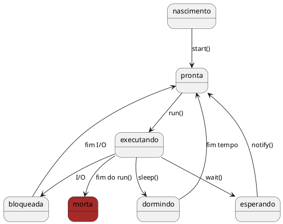

# Threads
- Threads são linhas de execuções que realizam tarefas simultâneas (caso tenhamos mais de 1 processador) ou de forma a compartilhar o processamento. 
- Cada thread é como um programa individual que tem total poder sobre a CPU.
- Java suporta explicitamente como parte da linguagem.
- Com o uso de Threads é possível dividir o programa em dois ou mais processos que podem rodar de forma paralela.
- Multithreading implica em duas ou mais tarefas rodando de forma concorrente (aparentemente em paralelo) dentro de um mesmo programa.
- Alguns programas necessitam fazer várias tarefas que requerem recursos computacionais diversos. Se estas tarefas podem ser feitas independentemente, então é possível usar threads para que o programa não fique limitado a performance dos recursos lentos (I/O).

<figure>

```plantuml

@startuml
[T1] lasts 5 days
[T2] lasts 3 days
[T2] starts at [T1]'s end
[T3] lasts 5 days
[T3] starts at [T2]'s end


[T1.1] as [T4] lasts 6 days
[T4] displays on same row as [T1]
[T4] starts at [T3]'s end

[T3.1] as [T5] lasts 4 days
[T5] displays on same row as [T3]
[T5] starts at [T4]'s end

	
[T2.1] as [T6] lasts 3 days
[T6] displays on same row as [T2]
[T6] starts at [T5]'s end

@enduml
```

<figcaption>Exemplo de uso de tempo do processador pelas Threads.</figcaption>
</figure>

<br>

<figure>



<figcaption>Diagrama de estado de uma Thread.</figcaption>
</figure>

- Existem duas formas para criar um thread: 
    - Estendendo a classe `Thread`
    - Implementando a interface `Runnable`. 
- Nos dois casos é necessário sobrescrever o método `run()` que é o " main()" do thread. 
- O método run deve conter a execução que irá rodar pelo tempo de vida do thread. Quando o método terminar, o thread morre. 

- Para iniciar o thread é necessário chamar o método `start()` . 
- É a maquina virtual quem controla a execução e o ciclo de vida do thread. 

## Herdando a classe Thread

```java
public class ThreadA extends Thread { 
    public void run(){ 
        for(int x=0;x<1000000;x++){ 
            System.out.println("A: "+x); 
        } 
    }
}
```

## Implementando a interface Runnable
```java
public class ThreadB implements Runnable { 
    public void run(){ 
        for(int x=0;x<1000000;x++){ 
            System.out.println("B: "+x); 
        } 
    } 
}
```

```java
public class TesteThread{ 
    public static void main(String[] args){ 
        ThreadA ta = new ThreadA(); 
        Thread tb = new Thread(new ThreadB()); 
        ta.start(); 
        tb.start(); 
    } 
}

```
- Estendendo a classe Thread significa que a subclasse não pode estender qualquer outra classe, enquanto que a classe que implementa a interface Runnable tem essa opção.

## Synchronized
- Permite que blocos sensíveis ao acesso simultâneo sejam protegidos de corrupção
- Impede que objetos os utilizem ao mesmo tempo. 
    - Se um recurso crítico está sendo usado, só um thread tem acesso. 
    - É preciso que os outros esperem até que o recurso esteja livre. 
- Métodos sincronizados são métodos que são usados para controlar o acesso a um objeto. 
- Uma thread apenas executa um método sincronizado depois que adquiriu o bloqueio para o objeto do método ou classe. 
- Se o bloqueio já está em poder de outra thread, a thread chamada aguarda. 
- Uma thread abandona o bloqueio simplesmente ao finalizar do método sincronizado, permitindo que a próxima thread esperando por este bloqueio possa prosseguir. 
- Métodos sincronizados são úteis em situações em que os métodos podem manipular o estado de um objeto de formas que podem corromper o estado, se executados simultaneamente. 

```java
//...
public void metodo() {
 synchronized (this) {
 // conteudo do metodo
 }
}
//...

public synchronized void metodo() {
 // conteudo do metodo
}

//...
```

## Estados de uma Thread

- Nova Thread
    - Quando uma Thread é criada mas não foi chamado o start()
- Rodando
    - Quando o método start() é chamado em uma nova thread ela altera o seu estado para em execução é chamando o método run()
- Não Execução
    - Uma thread interrompe sua execução quando um quatro seguintes eventos ocorrem:
        - Quando o método sleep() é chamado e ele dorme por um período de tempo especificado
        - Quando o método suspend() é invocado
        - Quando o método wait() é chamado e a thread espera para a notificação de um recurso livre ou aguarda a conclusão de outra thread ou espera para adquirir um bloqueio de um objeto.
        - A thread está bloqueado em I / O e aguarda a sua conclusão

## Acessando informações da Threads
Thread.currentThread() pode retornar uma saída como Thread [threadA, 5, main]
- Sendo
    - nome da Thread
    - prioridade da thread 
    - nome do grupo a que pertence
## Prioridade de Execução
- Nas threads a prioridade pode ser setada a qualquer momento
    - setPriority()
    - getPriority()
- Thread 
    - MIN_PRIORITY (0)
    - NORM_PRIORITY (5)
    - MAX_PRIORITY (10)

## Gerenciando as Threads
- Dormir e acordar
    - A classe thread contém um método estático chamado sleep() que faz a thread em execução no momento pause sua execução e mude para o estado de sono. A thread vai dormir por pelo menos o tempo especificado em seu parâmetro, antes de entrar no estado executável. 
- Waiting and Notifying
    - Esperando e notificando fornecer os meios de comunicação entre as thread que sincroniza sobre o mesmo objeto. 
    - As threads executam os métodos wait() e notify() (ou notifyAll()) no objeto compartilhado para esta finalidade. 
    - O notifyAll (), notify() e wait() são métodos da classe Object. Estes métodos podem ser chamados apenas a partir de dentro de um contexto sincronizado (método sincronizado ou bloco sincronizado), caso contrário, a chamada irá resultar em um IllegalMonitorStateException. 
    - O notifyAll() método acorda todas as threads em espera no recurso. Nesta situação, as threads despertadas competem para o recurso. Uma threads recebe o recurso e os outros vão voltar a esperar.


<!--
TODO: Add Java CompletableFuture
TODO: Add Java Callable
https://www.baeldung.com/java-asynchronous-programming
https://www.devmedia.com.br/processamento-assincrono-em-java-com-future-e-futuretask/33851
https://www.digitalocean.com/community/tutorials/java-callable-future-example

https://howtodoinjava.com/java/multi-threading/java-callable-future-example/

-->


# Links w3schools

<ul>
    <li><a href="https://www.w3schools.blog/thread-life-cycle-in-java">Thread life cycle</a></li>
    <li><a href="https://www.w3schools.blog/way-of-creating-thread-in-java">Way of creating thread</a></li>
    <li><a href="https://www.w3schools.blog/better-way-to-create-a-thread-in-java">Which is a better way to create a
            thread?</a></li>
    <li><a href="https://www.w3schools.blog/methods-of-thread-class">Methods of Thread class</a></li>
    <li><a href="https://www.w3schools.blog/thread-start-vs-run-method">Difference between thread start and run
            method</a></li>
    <li><a href="https://www.w3schools.blog/why-we-call-start-method-in-thread">Why we call start method in thread?</a>
    </li>
    <li><a href="https://www.w3schools.blog/override-start-method-in-thread">Can we override start method?</a></li>
    <li><a href="https://www.w3schools.blog/override-run-method-in-thread">Can we override run method?</a></li>
    <li><a href="https://www.w3schools.blog/start-a-thread-twice">Is it possible to start a thread twice?</a></li>
    <li><a href="https://www.w3schools.blog/thread-scheduling-in-java">Thread scheduling</a></li>
    <li><a href="https://www.w3schools.blog/thread-priority-in-java">Thread priority</a></li>
    <li><a href="https://www.w3schools.blog/naming-a-thread-in-java">Naming a thread</a></li>
    <li><a href="https://www.w3schools.blog/joining-a-thread-in-java">What is join method?</a></li>
    <li><a href="https://www.w3schools.blog/daemon-thread-in-java">Daemon thread</a></li>
    <li><a href="https://www.w3schools.blog/call-run-method-directly">Can we call run method directly?</a></li>
    <li><a href="https://www.w3schools.blog/yield-sleep-thread-methods">What is the difference between sleep and yield
            method?</a></li>
    <li><a href="https://www.w3schools.blog/deadlock-in-java">Deadlock</a></li>
    <li><a href="https://www.w3schools.blog/starvation-in-java">Starvation</a></li>
    <li><a href="https://www.w3schools.blog/inter-thread-communication-in-java">Inter-thread communication</a></li>
    <li><a href="https://www.w3schools.blog/synchronization-in-java">Synchronization</a></li>
    <li><a href="https://www.w3schools.blog/synchronized-method-in-java">Synchronized method</a></li>
    <li><a href="https://www.w3schools.blog/static-synchronization-in-java">Static synchronization</a></li>
    <li><a href="https://www.w3schools.blog/synchronized-block-in-java">Synchronized block</a></li>
</ul>

<!-- @include: ../bib/bib.md -->