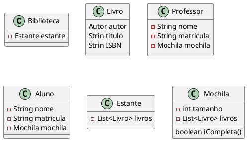

# Exercício: Emprestimo Livro
Utilizando os conhecimentos de O.O. (Classes, Objetos, Encapsulamento, Construtor e ArrayList) construa um programa para controle de emprestimos de livros em uma biblioteca universitária. Cada Aluno pode pegar, no maximo, 2 livros ao mesmo tempo e cada Professor 5. Devem ser definidas as rotinas de buscar um livro e realizar o emprestimo (limitando por cada tipo de usuaário) e fazer a devolução do livro e emprestar para outro usuário.
Roteiro:

- Criar estante de livros com 10 exemplares
- Um aluno busca um livro e guarda em sua mochila
- Um aluno busca um livro e guarda em sua mochila
- Um aluno busca um livro e guarda em sua mochila(erro)
- Um aluno devolve o livro
- Um professor busca um livro e guarda em sua mochila

# Link entrega

[link](https://classroom.github.com/a/1vYMcMqN)

::: details 

:::
