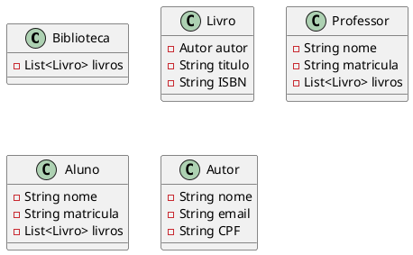

# Exercício: Emprestimo Livro
Utilizando os conhecimentos de O.O. (Classes, Objetos, Encapsulamento, Construtor e ArrayList) construa um programa para controle de emprestimos de livros em uma biblioteca universitária. Cada Aluno pode pegar, no maximo, 2 livros ao mesmo tempo e cada Professor 5. Devem ser definidas as rotinas de buscar um livro e realizar o emprestimo (limitando por cada tipo de usuaário) e fazer a devolução do livro e emprestar para outro usuário.
Roteiro:

- Criar estante de livros com 10 exemplares
- Um aluno busca um livro e guarda em sua mochila
- Um aluno busca um livro e guarda em sua mochila
- Um aluno busca um livro e guarda em sua mochila(erro)
- Um aluno devolve o livro
- Um professor busca um livro e guarda em sua mochila

# Link entrega

[link](https://classroom.github.com/a/1vYMcMqN)

::: details 



```java
public class Main {
    public static void main(String[] args) {

        Biblioteca biblioteca = new Biblioteca();
        Autor autor1 = new Autor("Jose","jose@seila.com","123.456.789.-11");
        biblioteca.adicionarLivro(new Livro("Java 1", "Livro sobre java", 10, "123-4565-15", autor1));
        biblioteca.adicionarLivro(new Livro("Java 2", "Livro sobre java", 10, "123-4565-25", autor1));
        biblioteca.adicionarLivro(new Livro("Java 3", "Livro sobre java", 10, "123-4565-35", autor1));
        biblioteca.adicionarLivro(new Livro("Java 4", "Livro sobre java", 10, "123-4565-45", autor1));
        biblioteca.adicionarLivro(new Livro("Java 5", "Livro sobre java", 10, "123-4565-55", new Autor("Jose 2","jose@seila.com","123.456.789.-22")));
        biblioteca.adicionarLivro(new Livro("Java 6", "Livro sobre java", 10, "123-4565-65", autor1));
        biblioteca.adicionarLivro(new Livro("Java 7", "Livro sobre java", 10, "123-4565-75", autor1));

        Aluno aluno = new Aluno();
        biblioteca.solicitaEmprestimo(aluno, "123-4565-55");
        biblioteca.solicitaEmprestimo(aluno, "123-4565-65");
        biblioteca.solicitaEmprestimo(aluno, "123-4565-75");
        System.out.println(aluno);
        biblioteca.soliticaDevolucao(aluno, "123-4565-55");
        System.out.println(aluno);

        Professor professor = new Professor();
        biblioteca.soliticaEmprestimo(professor, "123-4565-55");
        System.out.println(professor);
        biblioteca.solicitaEmprestimo(aluno, "123-4565-55");
        System.out.println(aluno);
   }
}
```
:::
