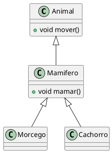
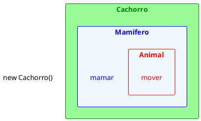
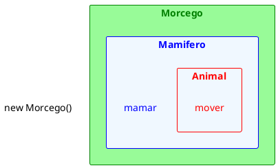

# Exercício de Herança 1

1. Considere o código abaixo, que utiliza as classes da UML apresentada, e indique, caso exista algum erro, a linha e qual o erro.

<figure>

<figcaption>Relação entre Animal, Mamímero, Morcego e Cachorro.</figcaption>
</figure>

@[code](./code/code1.java)

@[code](./code/code2.java)

<figure>

<figcaption>Criando um objeto Cachorro.</figcaption>
</figure>

<figure>

<figcaption>Criando um objeto Morcego.</figcaption>
</figure>

