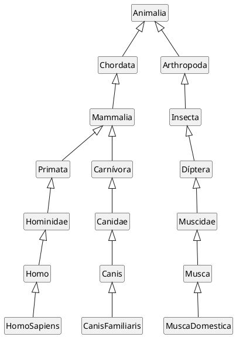

# Exercício de Herança 2

[^UFF]

A hierarquia de classificação científica dos seres vivos segue a taxonomia de Lineu. Abaixo é apresentado um sumário parcial do mais geral (reino) para o mais específico (Espécie) na classificação. Neste sumário, Império, Domínio e Sub/Superdivisões são omitidos por simplicidade: 
- Reino 
- Filo (animais) / Divisão (plantas) 
- Classe 
- Ordem 
- Família 
- Gênero 
- Espécie 

Com base no sumário acima, a classificação do homem, cão e mosca é dada por: 

Reino 

|         | Homem        | Cão              | Mosca           |
| ------- | ------------ | ---------------- | --------------- |
| Reino   | Animalia     | Animalia         | Animalia        |
| Filo    | Chordata     | Chordata         | Arthropoda      |
| Classe  | Mammalia     | Mammalia         | Insecta         |
| Ordem   | Primata      | Carnívora        | Díptera         |
| Família | Hominidae    | Canidae          | Muscidae        |
| Gênero  | Homo         | Canis            | Musca           |
| Espécie | Homo sapiens | Canis familiaris | Musca domestica |

Fica evidente a partir deste exemplo que existe uma organização hierárquica nas classificações para o homem, cão e mosca. Esta hierarquia pode ser ilustrada por uma árvore: 

<figure>



<figcaption>Organização hierárquica nas classificações para o homem, cão e mosca.</figcaption>
</figure>


Neste exercício: 
1. Represente por meio de classes Java a hierarquia de classificação que envolve homem, cão e mosca na taxonomia de Lineu; 
1. <s>Em sua modelagem verifique se faz sentido todas as classes serem concretas ou se é preciso definir alguma(s) delas como abstrata(s);</s>
1. Implemente o método `String toString()` em `Animalia` e sobreescreva este método em toda subclasse, de modo que quando invocado retornará toda a taxonomia de uma dada instância, por exemplo, para uma instância de Homo sapiens seria: 

    ```java
    public class Principal{
        public static void main(String[] args) {
            System.out.println(new HomoSapiens());
        }
    }
    ```
    ```shell
    Reino Animalia 
    Filo Chordata
    Classe Mammalia 
    Ordem Primata 
    Família Hominidae 
    Gênero Homo 
    Espécie Homo sapiens 
    ```
1. Reescreva seu código, mantendo o mesmo comportamento, mas sem utilizar herança <s>(Será necessário alterar a classe `Principial`)</s>.


<!-- @include: ../../../bib/bib.md -->
